<div align="center">

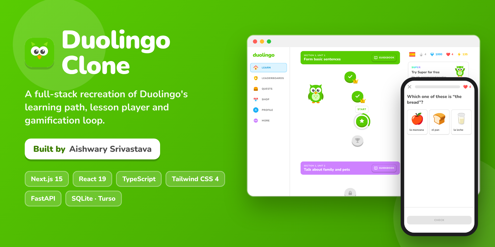

<h1>Duolingo Clone</h1>

<p><b>A full-stack recreation of Duolingo's learning path, lesson player and gamification loop:<br>
XP, streaks, hearts, crowns, a daily goal, leaderboards and achievements.</b></p>

<p>Designed and built by <b>Aishwary Srivastava</b></p>

<p>


<br>


<br>


</p>

<p>
<a href="#-see-it-in-action"><b>Demo</b></a> ·
<a href="#-features"><b>Features</b></a> ·
<a href="#-architecture"><b>Architecture</b></a> ·
<a href="#-getting-started"><b>Getting started</b></a> ·
<a href="#-api-reference"><b>API</b></a> ·
<a href="#-deployment"><b>Deployment</b></a> ·
<a href="#-author-and-contact"><b>Contact</b></a>
</p>

</div>

---

## 🎬 See it in action

<div align="center">
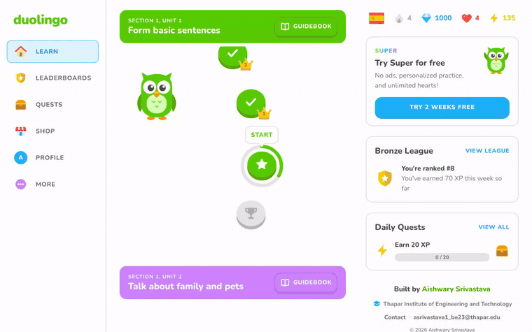
<br>
<sub>A 36-second run through one lesson as the seeded learner Alex.</sub>
</div>

<br>

The recording starts on the **learning path**, opens the popover of the current skill (**At the café**, lesson 2 of 3) and presses **Start**. It then plays a **perfect lesson** of eight exercises in their fixed order: two picture cards, match pairs, a word-bank translation into English, fill in the blank, select the meaning, a word-bank translation into Spanish and a typed answer. Each answer slides in the green feedback bar and grows the "in a row" combo. The run ends on **Lesson complete!** (15 XP = 10 for the lesson + 5 perfect-lesson bonus, 100% accuracy) and the **5-day streak** celebration, because the seeded 4-day streak was extended.

---

## Table of contents

1. [Overview](#-overview)
2. [Features](#-features)
3. [Tech stack](#-tech-stack)
4. [Architecture](#-architecture)
5. [Lesson player state machine](#-lesson-player-state-machine)
6. [Gamification rules](#-gamification-rules)
7. [Course content](#-course-content)
8. [Database schema](#-database-schema)
9. [API reference](#-api-reference)
10. [Project structure](#-project-structure)
11. [Getting started](#-getting-started)
12. [Testing and quality](#-testing-and-quality)
13. [Deployment](#-deployment)
14. [Assumptions, limitations and roadmap](#-assumptions-limitations-and-roadmap)
15. [Author and contact](#-author-and-contact)

---

## 📖 Overview

**Duolingo Clone** is an independent full-stack project by **Aishwary Srivastava** (Thapar Institute of Engineering and Technology). It recreates the core of the Duolingo web app: the winding learning path, the full-screen lesson player with five exercise types, and the game layer around it (XP, hearts, streaks, crowns, a daily goal, a weekly league, quests and achievements).

It is not a static mock-up. Every lesson is dealt, graded and scored by a FastAPI backend, and all progress is stored in a hand-written SQLite schema that runs on a local file in development and on [Turso](https://turso.tech) (cloud SQLite) in production. Progress survives page reloads and server restarts, and with Turso it also survives redeploys on Render's free tier.

**Goals of the project**

- **Look and feel like the real thing.** The path with locked, active and crowned skills, the popovers, the green and red feedback bar, sound effects, text-to-speech, confetti and streak celebrations.
- **Keep the rules honest.** Grading, heart loss, XP, streaks, crowns and unlocks are decided on the server. The browser never receives correct options or accepted answers (match pairs aside), so progress cannot be faked from the UI.
- **Make time testable.** Heart regeneration and streak expiry depend on the clock, so the backend has a simulated clock and the app has demo tools to jump forward a day.
- **Run for free.** Vercel for the frontend, Render for the API, Turso for the data, and a keep-alive pinger so the free API stays warm.

### At a glance

| What | Count | Detail |
| --- | ---: | --- |
| Course | 1 | Spanish for English speakers (`es-en`) |
| Units | 3 | Green, purple and blue themes |
| Skills | 9 | 3 per unit, each with an emoji icon |
| Lessons | 27 | 3 per skill, 10 XP each |
| Exercises | 216 | 8 per lesson, in the same order every time |
| Exercise types | 5 | Multiple choice, translate (word bank), match pairs, fill in the blank, type the answer |
| Vocabulary words | 54 | 6 per skill, plus 54 example sentences |
| Answer options | 823 | Picture cards, choices, word-bank tiles and pairs |
| Accepted answers | 123 | Translations and typed answers, including accepted alternatives |
| Seeded learners | 13 | The demo learner **Alex** and 12 leaderboard rivals |
| Achievements | 9 | Thresholds on XP, streak, lessons, perfect lessons and crowns |
| Daily quests | 3 | Computed from today's activity |
| Frontend routes | 10 | Including the `/` redirect, plus a custom 404 page |
| API operations | 15 | 11 app endpoints, the `/health` probe and 3 demo-only dev routes |
| Database tables | 16 | 6 explicit indexes and many `CHECK` constraints |
| Backend tests | 71 | 6 pytest files, all passing |
| Lines of code | 7,958 | Non-blank lines across frontend, backend, tests, schema and scripts |

---

## ✨ Features

### Learning path

The home screen (`/learn`) draws each unit as Duolingo's winding path under a sticky, colour-coded unit header. Skill nodes are **locked**, **active** or **completed**; a progress ring shows how many lessons are done at the current level, a crown badge shows the level (1 to 4, then a gold trophy when the skill is **legendary** at level 5), and a bouncing **START** bubble marks the next skill. Each unit ends with a trophy node, and the page scrolls the current skill into view on load.

<table>
<tr>
<td valign="top" width="50%">
<br>
<b>The path.</b> Greetings (level 2) and People (level 1) are crowned, At the café is active with one of three lessons done, and the next unit is locked. The right rail holds the stats bar, league and quest cards, and the author footer.
</td>
<td valign="top" width="50%">
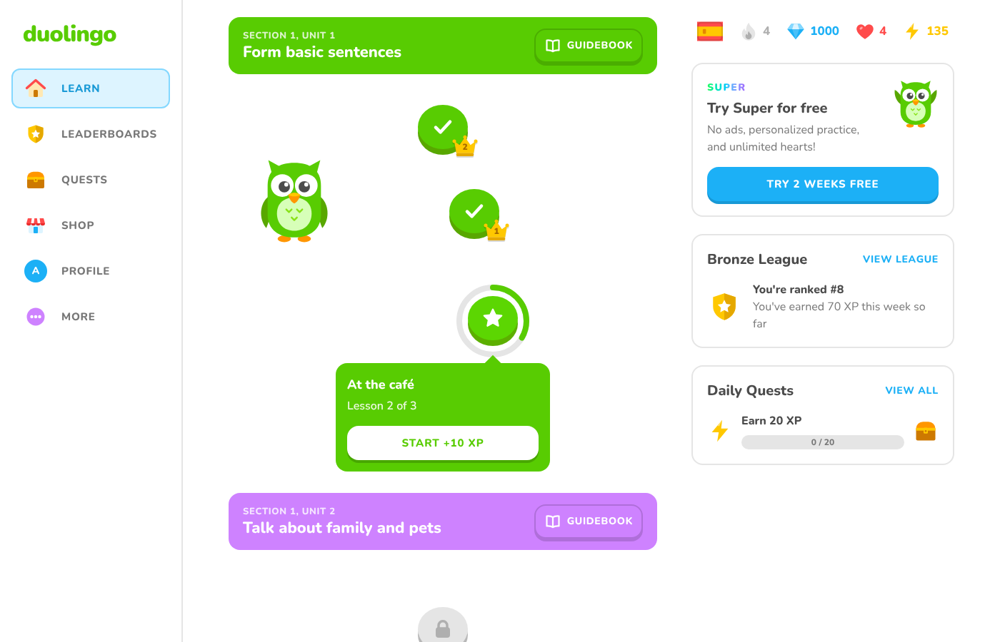<br>
<b>Skill popover.</b> Clicking a node opens its popover: <i>Start +10 XP</i> for the next lesson, <i>Practice +5 XP</i> once the skill has a crown, practice only for a legendary skill, and a disabled <i>Locked</i> button otherwise.
</td>
</tr>
</table>

<details>
<summary><b>More: the unit guidebook</b></summary>
<br>

<table>
<tr>
<td valign="top" width="50%">
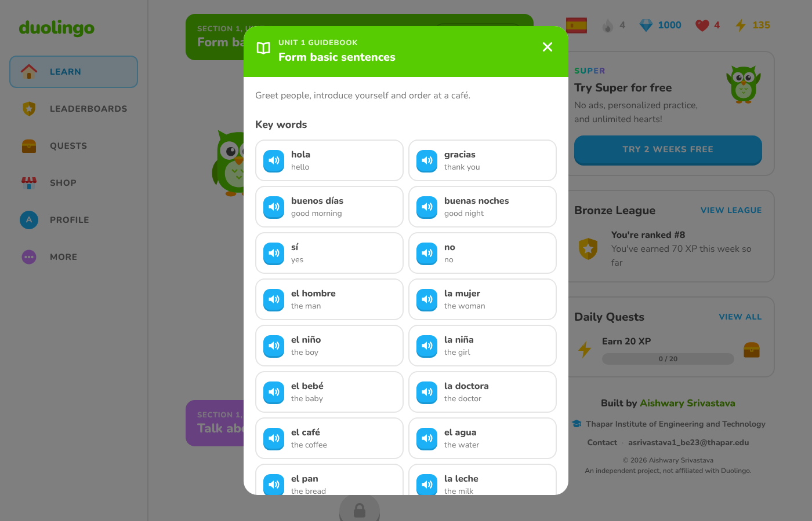
</td>
<td valign="top" width="50%">
<b>Guidebook.</b> Every unit header has a <b>Guidebook</b> button. It opens the unit's key words (taken from its match-pairs exercises) and key phrases (its Spanish sentences), each with a speaker button that reads it aloud with the browser's speech synthesis.
</td>
</tr>
</table>

</details>

### Lesson player and the five exercise types

Lessons and practice sessions open full screen (`/lesson/[skillId]` and `/practice`). A header shows the quit button, the progress bar and the heart count; the footer holds **Skip** and **Check**. Every exercise type has its own renderer:

<table>
<tr>
<td valign="top" width="50%">
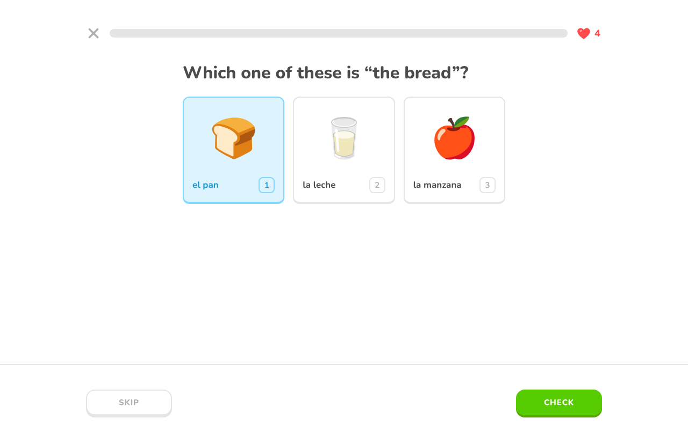<br>
<b>Multiple choice: picture cards.</b> Three illustrated cards; the number keys 1 to 3 pick one. The same type also powers <i>Select the correct meaning</i> with sentence options.
</td>
<td valign="top" width="50%">
<br>
<b>Match pairs.</b> Five Spanish words against five English ones (keys 1 to 0). Tapping a Spanish word reads it aloud, matched pairs fade out, a wrong pair shakes, and the exercise submits itself when the last pair is found.
</td>
</tr>
<tr>
<td valign="top" width="50%">
<br>
<b>Translate with a word bank.</b> The learner taps tiles to build the translation; going from Spanish to English, the owl also reads the sentence aloud (the speaker button repeats it). The bank holds the answer's words plus up to three extra words, and <kbd>Backspace</kbd> removes the last tile.
</td>
<td valign="top" width="50%">
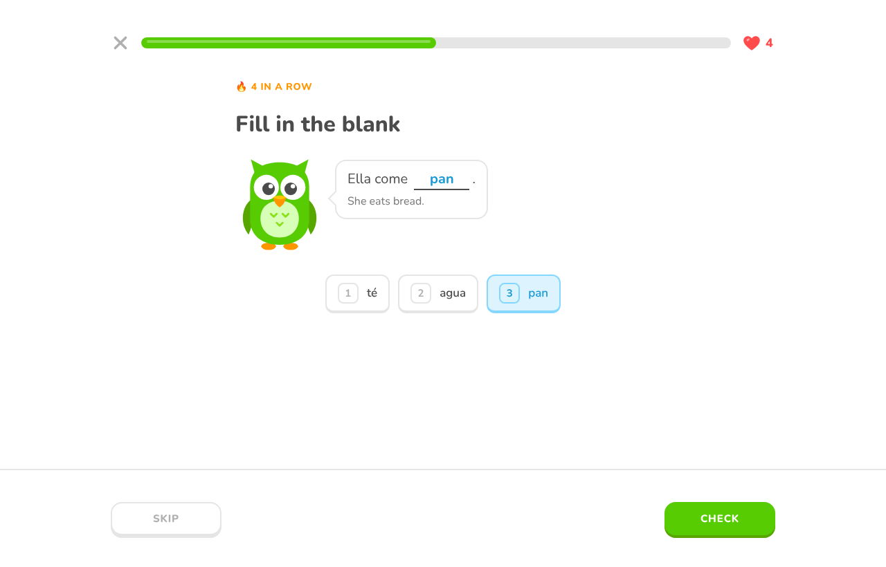<br>
<b>Fill in the blank.</b> A Spanish sentence with a gap, its English meaning underneath and three choices. The chosen word is previewed inside the sentence.
</td>
</tr>
<tr>
<td valign="top" width="50%">
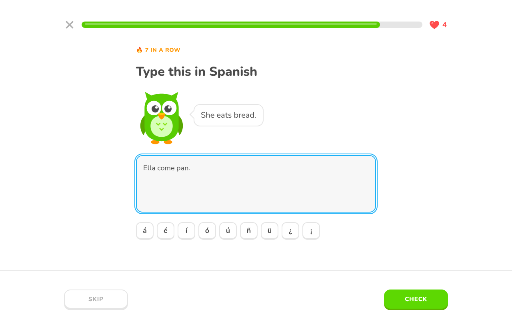<br>
<b>Type the answer.</b> Free text with an on-screen accent keyboard (á é í ó ú ñ ü ¿ ¡). Case and punctuation are ignored; an answer that is only missing accents is accepted with the note <i>"Pay attention to the accents."</i>
</td>
<td valign="top" width="50%">
<b>Keyboard and sound</b>
<ul>
<li><kbd>1</kbd>–<kbd>9</kbd> and <kbd>0</kbd> pick options (ignored while typing).</li>
<li><kbd>Enter</kbd> checks the answer, then continues.</li>
<li><kbd>Esc</kbd> closes modals and popovers.</li>
<li>Correct, wrong, completion and tap sounds are synthesised with the Web Audio API (no audio files) and follow the <i>Sound effects</i> setting.</li>
<li>Spanish prompts are read aloud with the Web Speech API.</li>
</ul>
</td>
</tr>
</table>

### Hearts, mistakes and feedback

After **Check** the feedback bar slides up: green with a word of praise, or red with the correct solution. A wrong or skipped answer costs one heart in a lesson and is **re-queued** at the end of the lesson, marked *↻ Previous mistake*, so a lesson only ends once every exercise has been answered correctly. The progress bar moves only on correct answers, and two or more correct answers in a row show a *🔥 N in a row* combo.

<table>
<tr>
<td valign="top" width="33%">
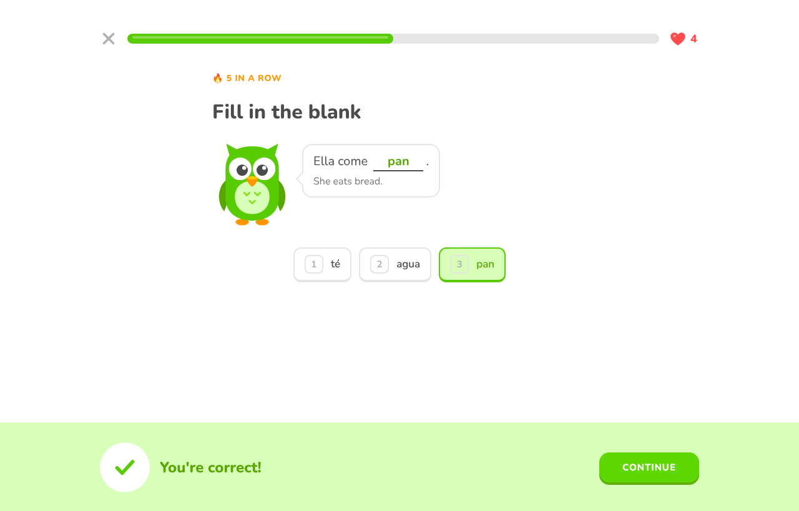<br>
<b>Correct.</b> Praise rotates between six phrases; the combo counter keeps climbing.
</td>
<td valign="top" width="33%">
<br>
<b>Wrong.</b> The red bar shows the correct solution and the heart count drops from 4 to 3.
</td>
<td valign="top" width="33%">
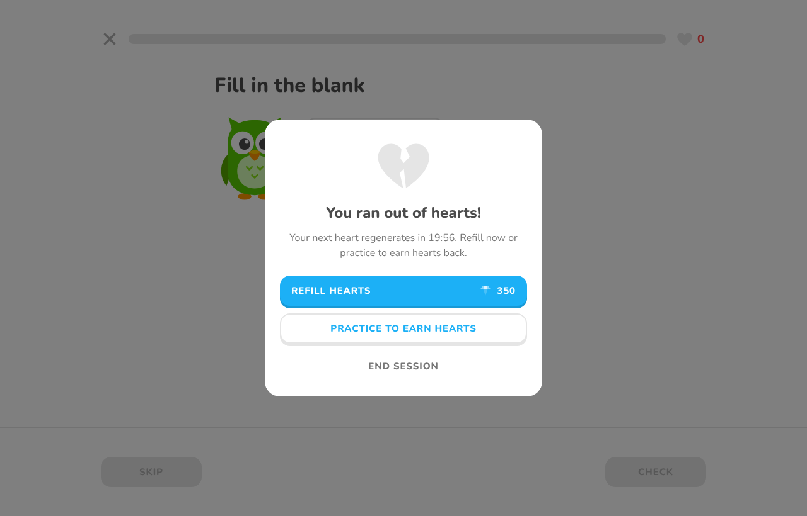<br>
<b>Out of hearts.</b> A countdown to the next heart, a 350-gem refill that resumes the same lesson, practice, or end the session.
</td>
</tr>
</table>

Quitting asks for confirmation first, and practice sessions never cost hearts, so they stay playable at zero hearts.

### Completion, streaks, XP and the daily goal

<table>
<tr>
<td valign="top" width="50%">
<br>
<b>Lesson complete.</b> Confetti and three result cards: total XP, accuracy (<i>Amazing</i> at 100%, <i>Good</i> from 80%, else <i>Nice try</i>) and time (<i>Speedy</i> under 90 seconds, else <i>Committed</i>). Highlights list crown progress or a level-up, a newly unlocked skill, the daily goal, a restored heart, the perfect-lesson bonus and new achievements.
</td>
<td valign="top" width="50%">
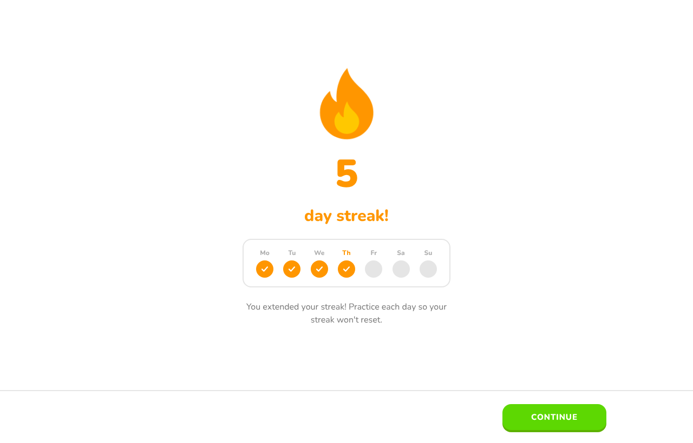<br>
<b>Streak celebration.</b> Shown after the results whenever the session extended the streak. The week strip runs Monday to Sunday and checks every day with XP.
</td>
</tr>
</table>

The daily goal (10, 20, 30 or 50 XP; 20 by default) is tracked in the stats bar's XP popover, on the Quests page and in the sidebar quest card, and the session that first crosses it reports **Daily goal complete!** once.

### Leaderboard, quests, shop, profile and settings

<table>
<tr>
<td valign="top" width="50%">
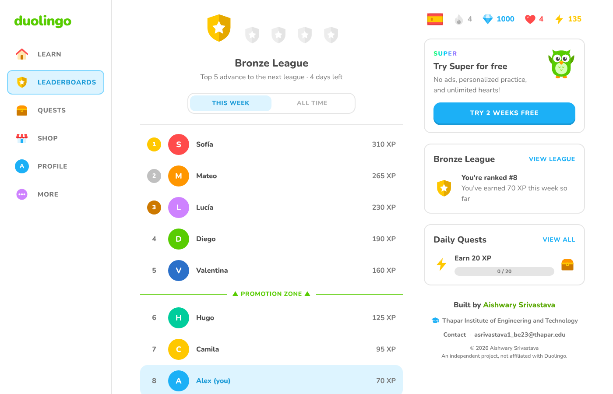<br>
<b>Leaderboard.</b> A Bronze league with <i>This week</i> and <i>All time</i> tabs against 12 seeded rivals, a promotion-zone line under the top five and the days left in the week.
</td>
<td valign="top" width="50%">
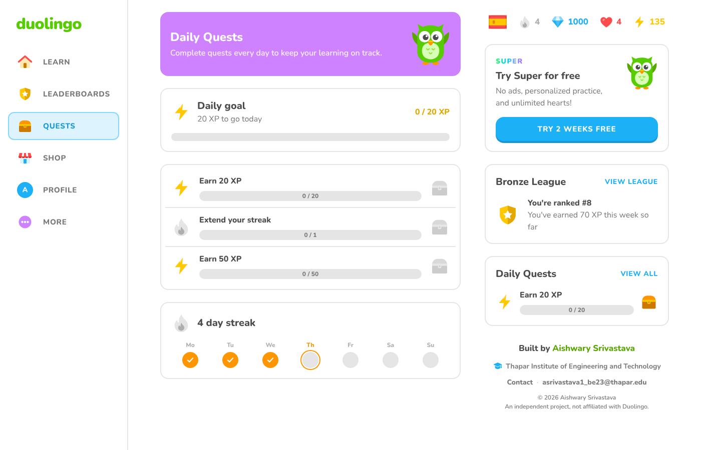<br>
<b>Daily quests.</b> Earn the daily goal, extend the streak and earn 50 XP, computed from today's activity, plus the daily goal card and the streak week.
</td>
</tr>
<tr>
<td valign="top" width="50%">
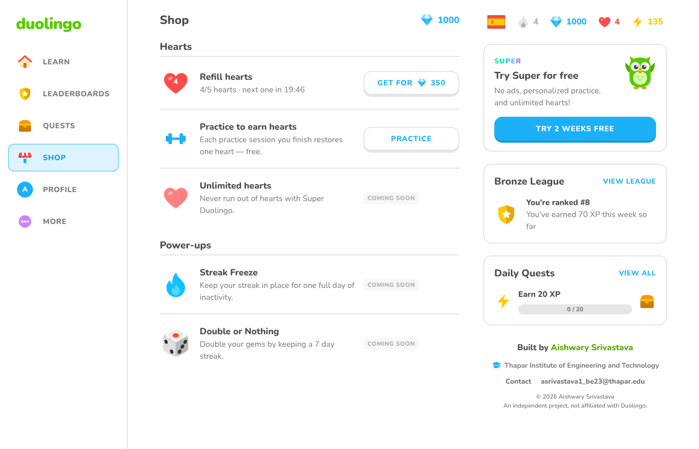<br>
<b>Shop.</b> Refill hearts for 350 gems (with the countdown to the next free heart), practise to earn a heart, and three items marked <i>Coming soon</i> (unlimited hearts and two power-ups).
</td>
<td valign="top" width="50%">
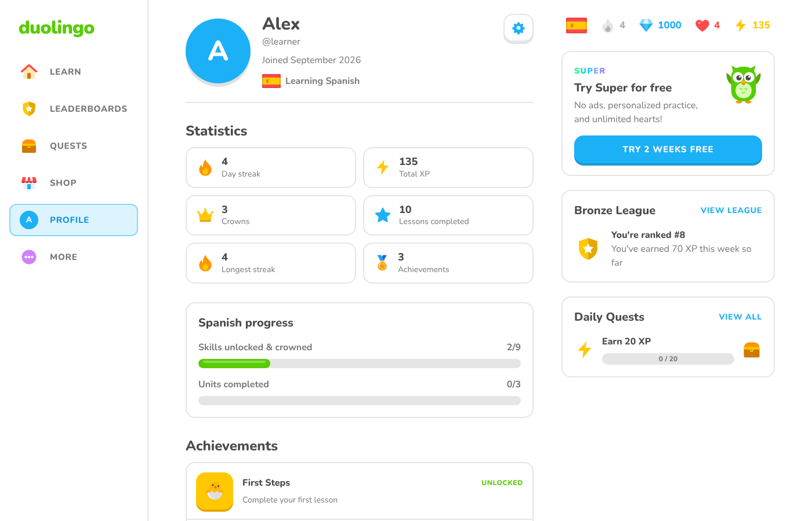<br>
<b>Profile.</b> Six statistics, course progress (skills crowned, units completed) and all nine achievements with progress bars. The gear button opens Settings.
</td>
</tr>
</table>

<details>
<summary><b>More: settings and the stats bar</b></summary>
<br>

<table>
<tr>
<td valign="top" width="50%">
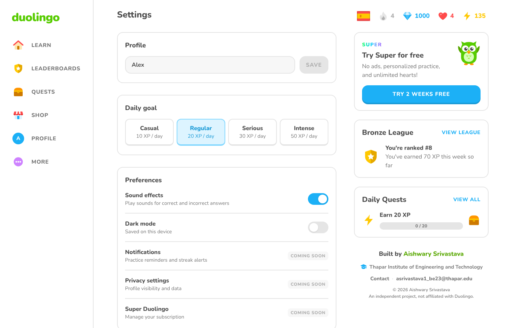<br>
<b>Settings.</b> Display name (1 to 30 characters), daily goal (<i>Casual</i> 10, <i>Regular</i> 20, <i>Serious</i> 30, <i>Intense</i> 50 XP), sound effects and dark mode. Further down: <b>Demo tools</b> (<i>Next day</i> and <i>Reset demo data</i>, shown only when the backend enables them) and an <b>About</b> card with the author credit and a Contact button.
</td>
<td valign="top" width="50%">
<b>The stats bar</b> sits at the top of every shell page (in the right rail on wide screens): course flag, streak, gems, hearts and total XP. Each one opens a popover; the hearts panel shows the regeneration countdown and a refill button.
<br><br>
The streak flame stays grey until today's first session is complete, which is why the seeded learner's 4-day streak is grey in these screenshots.
<br><br>
The <i>Super</i> card and the <i>Help</i> menu item answer with a "coming soon" toast.
</td>
</tr>
</table>

</details>

### Responsive layout and dark mode

The app shell adapts at Tailwind's default breakpoints:

| Width | Navigation | Stats | Right rail | Author footer |
| --- | --- | --- | --- | --- |
| under 768 px (phones) | Bottom tab bar with 5 icons | Sticky top bar | Hidden | After the page content, above the tab bar |
| 768 to 1023 px | 88 px icon rail | Sticky top bar | Hidden | After the page content |
| 1024 to 1279 px | 256 px sidebar with labels | Sticky top bar | Hidden | After the page content |
| 1280 px and wider | 256 px sidebar | In the right rail | 368 px: stats, Super, league and quest cards | At the end of the right rail |

Dark mode is a toggle in Settings. It is stored on the device (`localStorage`) and applied by a tiny inline script before the page renders, so there is no flash of the light theme.

<table>
<tr>
<td valign="top" width="25%" align="center">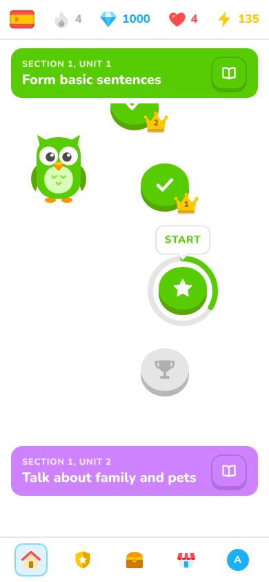<br><sub><b>Phone: path</b></sub></td>
<td valign="top" width="25%" align="center">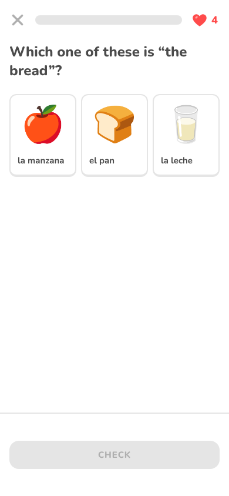<br><sub><b>Phone: lesson</b></sub></td>
<td valign="top" width="25%" align="center">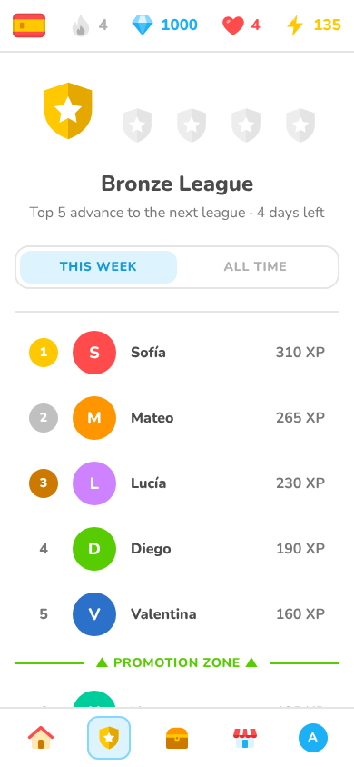<br><sub><b>Phone: leaderboard</b></sub></td>
<td valign="top" width="25%" align="center">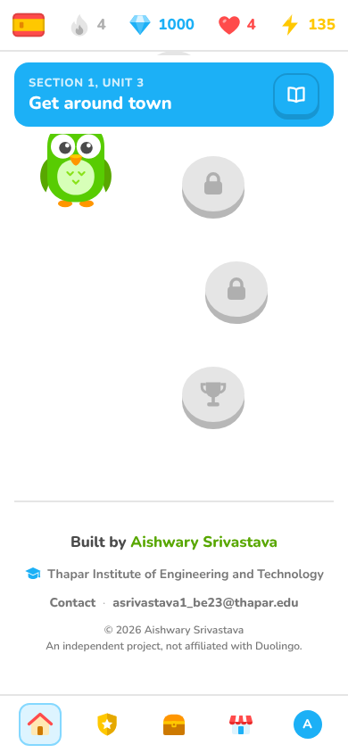<br><sub><b>Phone: footer</b></sub></td>
</tr>
</table>

<table>
<tr>
<td valign="top" width="50%">
<br>
<b>Dark mode: path.</b> Unit colours and buttons keep their contrast on the dark surface.
</td>
<td valign="top" width="50%">
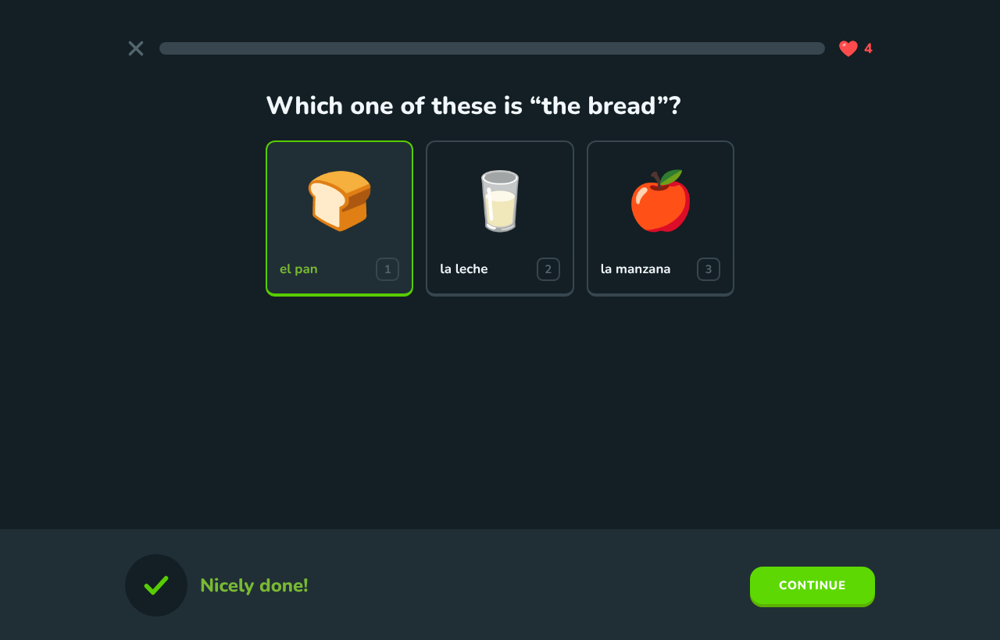<br>
<b>Dark mode: lesson.</b> The feedback bar and cards switch to dark surfaces too.
</td>
</tr>
</table>

<details>
<summary><b>More: dark profile and dark contact page</b></summary>
<br>

| Profile | Contact |
| :---: | :---: |
| 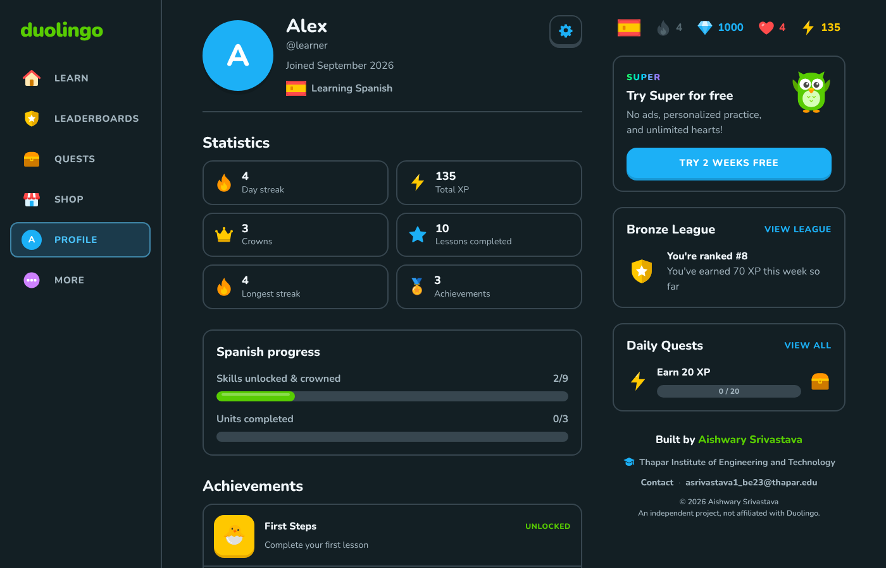 | 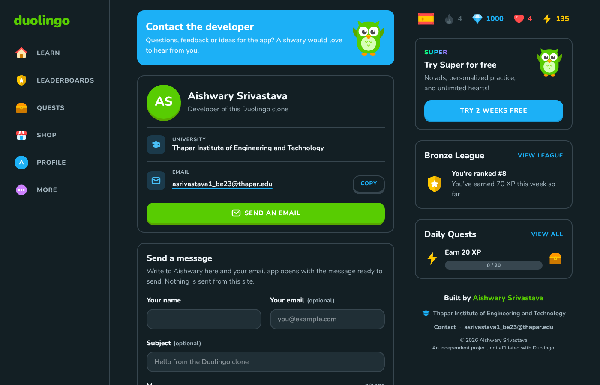 |

</details>

### Author footer and contact page

Every page credits the author. The footer reads **Built by Aishwary Srivastava** (linking to `/contact`), followed by the university, a Contact link, the email address, the copyright line and *"An independent project, not affiliated with Duolingo."* The 404 page carries a compact version of the credit, the Settings page ends with an **About** card, and the HTML head declares the author in its `authors` and `creator` metadata. The API's interactive docs (`/docs`) list the author's name and email as the API contact.

<table>
<tr>
<td valign="top" width="50%">
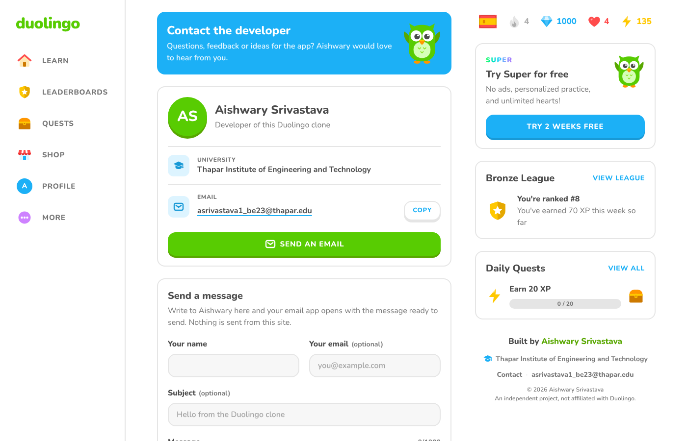<br>
<b>Contact page (<code>/contact</code>).</b> An author card with the university, the email address, a <b>Copy</b> button and <b>Send an email</b>, then a <b>Send a message</b> form and an <b>About this project</b> card listing the tech stack.
</td>
<td valign="top" width="50%">
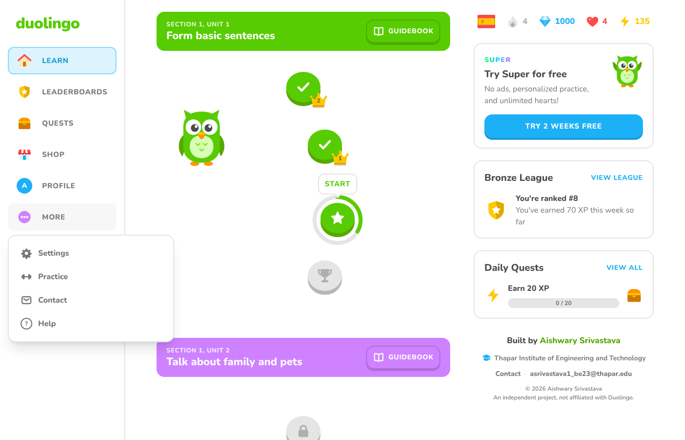<br>
<b>More menu.</b> On desktop the sidebar's <i>More</i> menu links to Settings, Practice, <b>Contact</b> and Help. On phones the footer and the Settings <i>About</i> card lead to the same page.
</td>
</tr>
</table>

<details>
<summary><b>More: the contact page on a phone, and how the form works</b></summary>
<br>

<table>
<tr>
<td valign="top" width="35%" align="center">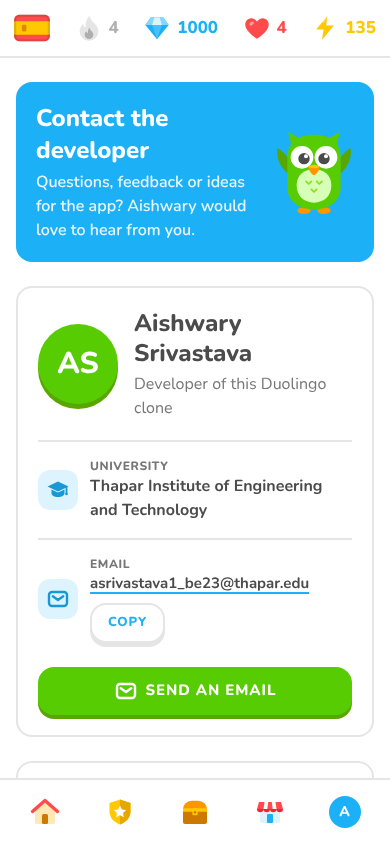</td>
<td valign="top" width="65%">

- **Name** and **message** are required; **email** and **subject** are optional (the subject defaults to *"Hello from the Duolingo clone"*).
- The message is limited to 1,000 characters with a live counter, and an invalid email shows an inline error.
- The button stays disabled until the form is valid. Submitting opens the visitor's email app with a pre-filled `mailto:` message; nothing is sent from the site and no backend is involved.
- **Copy** puts the address on the clipboard and confirms with a toast (or reports a failure).

</td>
</tr>
</table>

</details>

---

## 🧰 Tech stack

Aishwary Srivastava kept the stack deliberately small: no UI kit, no state library and no ORM. The design system lives in `globals.css` (colour tokens and component classes), shared state is three small React contexts, and the database is plain SQL.

| Layer | Technology | Why it was chosen |
| --- | --- | --- |
| Framework | **Next.js 15.5.27** (App Router) | File-based routes, layouts for the app shell versus the full-screen player, `next/font` and security headers in one config file |
| UI | **React 19.1.9** | A `useReducer` state machine for the lesson player and small contexts for shared state |
| Language | **TypeScript 5.9** (`strict`) | Hand-written types in `lib/types.ts` mirror the backend's Pydantic models, so every screen is checked against the API's shapes |
| Styling | **Tailwind CSS 4.3** and CSS variables | Utility classes plus design tokens; dark mode is a custom variant on `[data-theme="dark"]` |
| Font and media | Nunito (`next/font/google`), Web Audio API, Web Speech API | A close match to Duolingo's rounded type, synthesised sounds and spoken prompts with no asset files |
| Linting | ESLint 9 (`next/core-web-vitals`, `next/typescript`) | Catches hook and accessibility mistakes |
| API | **FastAPI 0.143.0** (Starlette 1.7.0) on **Uvicorn 0.54.0** | Typed request and response models and free OpenAPI docs at `/docs` |
| Validation | **Pydantic 2.13.5** | A discriminated union on `type` validates the six answer shapes |
| Database | **SQLite** (stdlib `sqlite3`) locally, **Turso** via **libsql 0.1.11** in production | One hand-written schema for both; Turso keeps data when Render's free disk is wiped |
| Config and time | python-dotenv 1.2.4, tzdata 2026.5 | `backend/.env` support and IANA time zones on every platform |
| Tests | **pytest 9.1.1** with FastAPI's `TestClient` (httpx2 2.13.1) | Fast in-process API tests on a fresh database per test |
| Hosting | Vercel (frontend), Render free plan with Python 3.12.7 (API), Turso (data) | Free tiers that fit a full-stack demo |
| Keep-alive | GitHub Actions cron, plus cron-job.org or UptimeRobot | Stops the free Render service from sleeping |

---

## 🧩 Architecture

### System overview

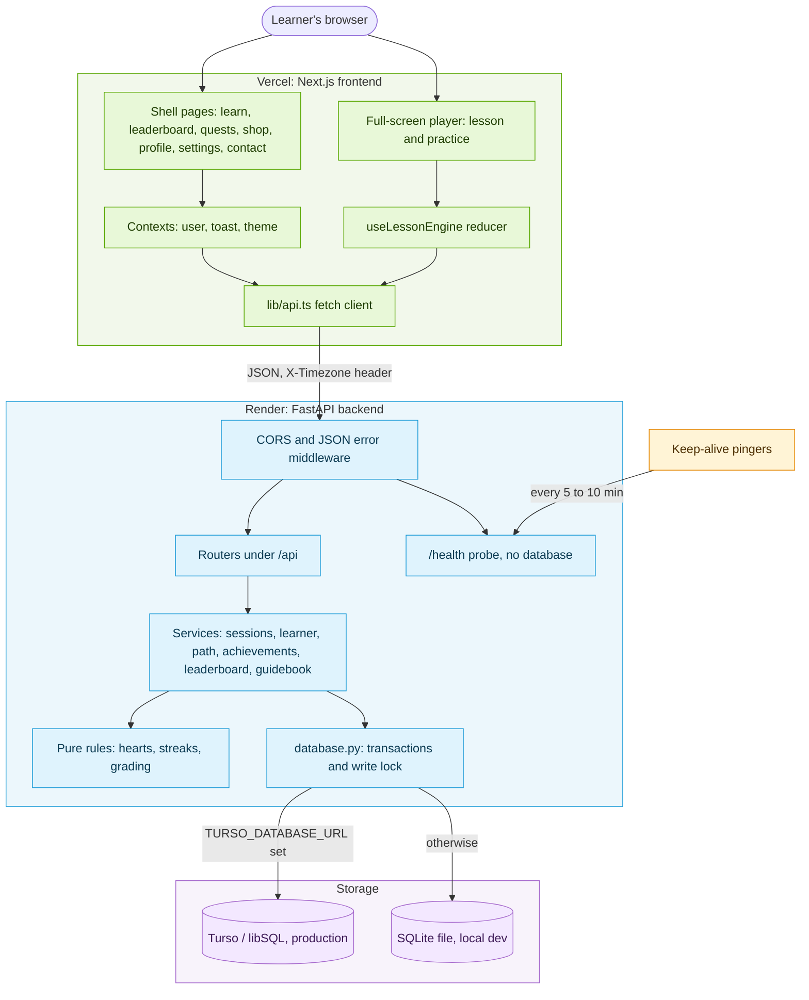
```mermaid
flowchart TB
    browser(["Learner's browser"])

    subgraph FE["Vercel: Next.js frontend"]
        direction TB
        shell["Shell pages: learn, leaderboard, quests, shop, profile, settings, contact"]
        player["Full-screen player: lesson and practice"]
        ctx["Contexts: user, toast, theme"]
        engine["useLessonEngine reducer"]
        client["lib/api.ts fetch client"]
    end

    subgraph BE["Render: FastAPI backend"]
        direction TB
        mw["CORS and JSON error middleware"]
        health["/health probe, no database"]
        routers["Routers under /api"]
        services["Services: sessions, learner, path, achievements, leaderboard, guidebook"]
        rules["Pure rules: hearts, streaks, grading"]
        dbl["database.py: transactions and write lock"]
    end

    subgraph ST["Storage"]
        turso[("Turso / libSQL, production")]
        sqlite[("SQLite file, local dev")]
    end

    pingers["Keep-alive pingers"]

    browser --> shell
    browser --> player
    shell --> ctx
    player --> engine
    ctx --> client
    engine --> client
    client -->|"JSON, X-Timezone header"| mw
    mw --> routers
    mw --> health
    routers --> services
    services --> rules
    services --> dbl
    dbl -->|"TURSO_DATABASE_URL set"| turso
    dbl -->|"otherwise"| sqlite
    pingers -->|"every 5 to 10 min"| health

    classDef fe fill:#e8f8d8,stroke:#58a700,color:#1f3d00
    classDef be fill:#dff3fd,stroke:#1899d6,color:#0b3a52
    classDef db fill:#f3e8ff,stroke:#a568cc,color:#3d1a57
    classDef ping fill:#fff4d6,stroke:#e58600,color:#4d2e00
    class shell,player,ctx,engine,client fe
    class mw,health,routers,services,rules,dbl be
    class turso,sqlite db
    class pingers ping
    style FE fill:#58a70014,stroke:#58a700
    style BE fill:#1899d614,stroke:#1899d6
    style ST fill:#a568cc14,stroke:#a568cc
```

**How to read it.** The browser loads the Next.js app from Vercel. Shell pages share learner stats through `UserContext`; the lesson player runs its own reducer. Both talk to the API only through `lib/api.ts`, which sends the browser's time zone in an `X-Timezone` header with every request and never caches responses. On Render, requests pass the CORS and error middleware, then thin routers hand them to services. Services combine SQL with pure rule modules and write through `database.py`, which picks Turso when it is configured and the local SQLite file otherwise. The `/health` route sits beside the routers and never touches the database, so uptime pingers can call it cheaply.

### Key design decisions

| Decision | What it means in practice |
| --- | --- |
| **Server-authoritative game state** | The server deals exercises, grades every answer, records each attempt and spends hearts. Correct options and accepted answers are never sent, with one deliberate exception: a match-pairs exercise has to reveal its pairings so wrong taps can shake instantly, and the server still grades the final submission. |
| **Derived, not duplicated, progress** | Crown levels, ring progress, skill states and unlocks are all computed from one column, `lesson_progress.times_completed`, so they can never disagree. |
| **Lazy time-based rules** | Heart regeneration and streak expiry are worked out from stored timestamps whenever they are read. There are no background jobs, and `GET` requests never write. |
| **Explicit transactions and a write lock** | Connections run in autocommit mode and every write route uses `transaction()`: a process-wide lock, then `BEGIN IMMEDIATE`, then `COMMIT` (or a `ROLLBACK`, after which the original error is re-raised). Double-submitted answers or a double "complete" are serialised instead of racing. |
| **One schema, two engines** | `database.py` wraps the `libsql` client so it behaves like `sqlite3`: rows by column name, `:named` parameters, and `executemany` sent as batched multi-row inserts. No service query needed to change. |
| **Testable clock** | `Clock` combines real UTC time, a simulated day offset stored in `app_state` and the learner's time zone, so streak and heart behaviour can be demoed and tested across days. |
| **Thin layers** | Routers parse HTTP and open transactions; services hold the logic; `hearts`, `streaks` and `grading` are pure functions with no I/O and their own unit tests. |
| **Stable error codes** | Every expected failure is an `AppError` with a machine-readable code (`out_of_hearts`, `skill_locked`, ...) that the UI branches on. Unexpected errors become a logged JSON 500 that still carries CORS headers. |

### Life of a write request

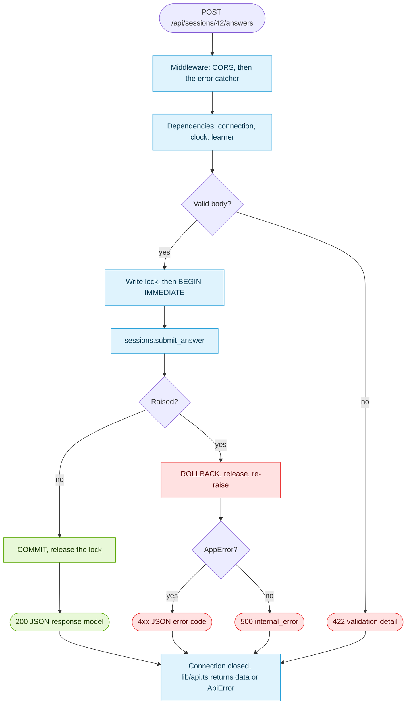
```mermaid
flowchart TD
    request(["POST /api/sessions/42/answers"])
    mw["Middleware: CORS, then the error catcher"]
    deps["Dependencies: connection, clock, learner"]
    valid{"Valid body?"}
    lock["Write lock, then BEGIN IMMEDIATE"]
    service["sessions.submit_answer"]
    raised{"Raised?"}
    commit["COMMIT, release the lock"]
    rollback["ROLLBACK, release, re-raise"]
    kind{"AppError?"}
    ok(["200 JSON response model"])
    apperr(["4xx JSON error code"])
    err500(["500 internal_error"])
    err422(["422 validation detail"])
    close["Connection closed, lib/api.ts returns data or ApiError"]

    request --> mw --> deps --> valid
    valid -->|"no"| err422
    valid -->|"yes"| lock --> service --> raised
    raised -->|"no"| commit --> ok
    raised -->|"yes"| rollback --> kind
    kind -->|"yes"| apperr
    kind -->|"no"| err500
    ok --> close
    apperr --> close
    err500 --> close
    err422 --> close

    classDef good fill:#e8f8d8,stroke:#58a700,color:#1f3d00
    classDef bad fill:#ffe1e1,stroke:#ea2b2b,color:#5c0b0b
    classDef step fill:#dff3fd,stroke:#1899d6,color:#0b3a52
    class ok,commit good
    class apperr,err500,err422,rollback bad
    class mw,deps,lock,service,close step
```

Middleware added later wraps earlier middleware, so the order from the outside in is CORS, then `UnhandledErrorMiddleware`, then FastAPI's exception handling. Because the error middleware sits *inside* CORS, even an unexpected 500 reaches the browser as readable JSON instead of an opaque CORS failure. Each request gets its own connection, and reads run without a transaction.

### One lesson, end to end

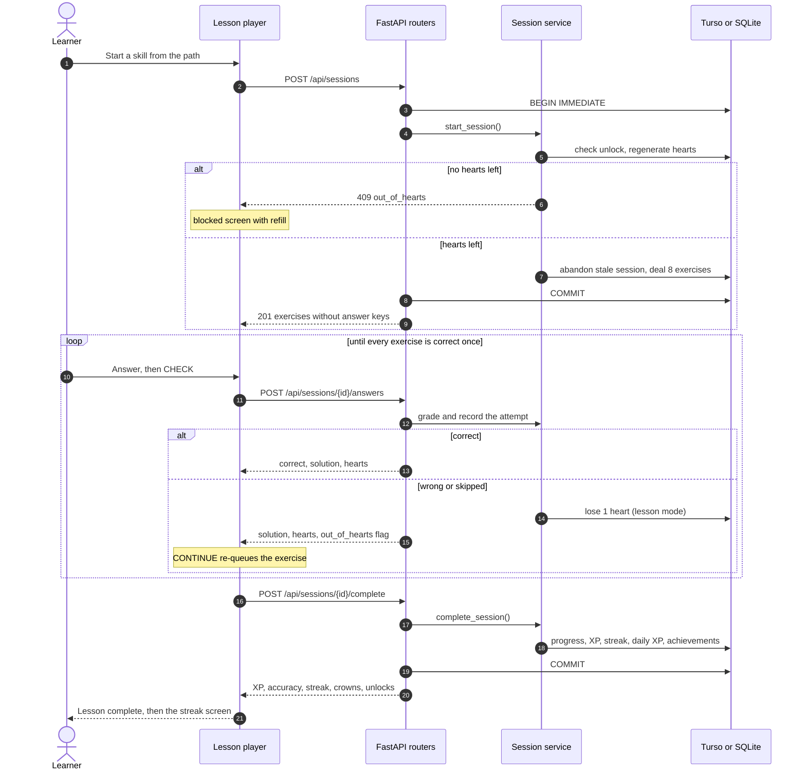
```mermaid
sequenceDiagram
    autonumber
    actor L as Learner
    participant UI as Lesson player
    participant API as FastAPI routers
    participant SVC as Session service
    participant DB as Turso or SQLite

    L->>UI: Start a skill from the path
    UI->>API: POST /api/sessions
    API->>DB: BEGIN IMMEDIATE
    API->>SVC: start_session()
    SVC->>DB: check unlock, regenerate hearts
    alt no hearts left
        SVC-->>UI: 409 out_of_hearts
        Note over UI: blocked screen with refill
    else hearts left
        SVC->>DB: abandon stale session, deal 8 exercises
        API->>DB: COMMIT
        API-->>UI: 201 exercises without answer keys
    end
    loop until every exercise is correct once
        L->>UI: Answer, then CHECK
        UI->>API: POST /api/sessions/{id}/answers
        API->>SVC: grade and record the attempt
        alt correct
            API-->>UI: correct, solution, hearts
        else wrong or skipped
            SVC->>DB: lose 1 heart (lesson mode)
            API-->>UI: solution, hearts, out_of_hearts flag
            Note over UI: CONTINUE re-queues the exercise
        end
    end
    UI->>API: POST /api/sessions/{id}/complete
    API->>SVC: complete_session()
    SVC->>DB: progress, XP, streak, daily XP, achievements
    API->>DB: COMMIT
    API-->>UI: XP, accuracy, streak, crowns, unlocks
    UI-->>L: Lesson complete, then the streak screen
```

Every write in this flow is a short transaction. Completion loads the course path before and after saving, which is how it knows whether the crown level went up and which skill, if any, was just unlocked. After the lesson the player refreshes `/api/me`, so the stats bar, quests and league card are up to date the moment the learner returns to the path.

---

## 🎮 Lesson player state machine

The player is a reducer in [`useLessonEngine.ts`](frontend/src/hooks/useLessonEngine.ts) with nine phases and fourteen actions. API results drive every transition:

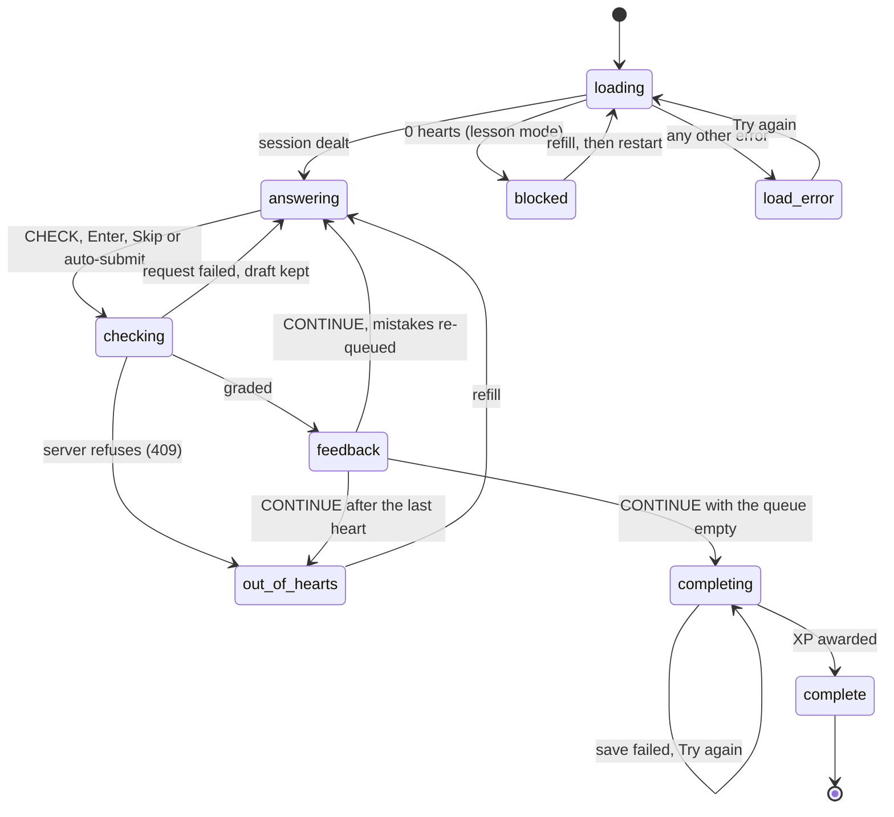
```mermaid
stateDiagram-v2
    [*] --> loading
    loading --> answering: session dealt
    loading --> blocked: 0 hearts (lesson mode)
    loading --> load_error: any other error
    load_error --> loading: Try again
    blocked --> loading: refill, then restart
    answering --> checking: CHECK, Enter, Skip or auto-submit
    checking --> feedback: graded
    checking --> answering: request failed, draft kept
    checking --> out_of_hearts: server refuses (409)
    feedback --> answering: CONTINUE, mistakes re-queued
    feedback --> out_of_hearts: CONTINUE after the last heart
    feedback --> completing: CONTINUE with the queue empty
    out_of_hearts --> answering: refill
    completing --> completing: save failed, Try again
    completing --> complete: XP awarded
    complete --> [*]
```

**Guards against fast clicks and slow networks**

- **Phase guards.** Actions are ignored outside their phase: drafts change only while `answering`, `continue` works only in `feedback`, and the Check button is disabled unless the learner is answering with a complete answer.
- **Double-submit guard.** A ref blocks a second `check()` before React has re-rendered, so a double click or a held <kbd>Enter</kbd> sends one request.
- **Failed requests.** A failed check shows a toast and returns to `answering` with the draft intact. A failed completion stays in `completing` and offers *Try again* until the save succeeds.
- **Hearts.** Losing the last heart moves to `out_of_hearts` on CONTINUE, after the learner has seen the correction. A refill resumes the **same** session. If the server refuses an answer because hearts ran out elsewhere, the player jumps straight to `out_of_hearts`.
- **Quitting.** Leaving at any point before `complete` calls `/abandon`, which is safe to repeat; hearts already lost stay lost.
- **Server-side backstops.** The API rejects a second completion (`409 session_closed`) and a completion with unsolved exercises (`409 session_incomplete`).

> [!NOTE]
> The reducer also accepts `out_of_hearts → completing`, but it cannot happen in practice: a wrong answer is always re-queued, so the queue is never empty at that moment. The diagram leaves it out.

---

## 🏆 Gamification rules

All balance constants live in [`backend/app/rules.py`](backend/app/rules.py); the rules themselves are in `backend/app/services/`.

| Mechanic | Rule |
| --- | --- |
| **XP** | A lesson is worth 10 XP, plus a 5 XP bonus when it had no wrong or skipped answers. A practice session is worth 5 XP. Completing a session is the only way to earn XP. |
| **Hearts** | Maximum 5. Each wrong or skipped answer in a lesson costs 1; practice never costs hearts. At 0 hearts a lesson can neither start nor continue (`409 out_of_hearts`), but practice still can. |
| **Regeneration** | +1 heart for every full `HEART_REGEN_MINUTES` (30 by default) since the first heart was lost. Partial progress toward the next heart is kept, and the timer stops at 5. |
| **Refill** | 350 gems refill hearts to 5. The API answers `409 hearts_full` when hearts are already full and `409 not_enough_gems` below 350 gems. |
| **Practice** | Up to 8 random exercises from lessons already completed (in one skill, or across the course). Each finished practice restores 1 heart. With nothing completed yet: `409 nothing_to_practice`. |
| **Completion** | A session completes only when every dealt exercise has at least one correct attempt; mistakes are re-queued until fixed. |
| **Streak** | The first completed session of a day extends the streak if the previous active day was yesterday; otherwise it restarts at 1. After a missed day the streak is shown as 0. Days are the learner's local days. |
| **Daily goal** | 10, 20, 30 or 50 XP (default 20). *Complete* when today's XP reaches the goal; *just completed* is reported only by the session that crosses it. |
| **Crowns** | A skill's crown level is the lowest completion count among its 3 lessons, capped at 5 (**legendary**). 9 skills × 5 = 45 crowns in total. |
| **Next lesson** | The first lesson whose completion count has not passed the current level. A legendary skill has none (`409 skill_legendary`) and offers practice instead. |
| **Unlocking** | The first skill is always open; every other skill unlocks when the previous skill in course order reaches crown 1, across unit boundaries. Locked skills answer `403 skill_locked`. |
| **Achievements** | 9 thresholds, checked after every completed session; several can unlock at once. |
| **Leaderboard** | *This week* sums daily XP from Monday to today; *All time* ranks by total XP. Ties are broken by name. |
| **Gems** | The demo learner starts with 1,000. Gems are only ever spent (on refills), so two refills are possible. |
| **Daily quests** | Earn the daily goal, extend the streak, earn 50 XP. Computed in the browser from today's stats; the chest icons are decorative and grant nothing. |

### XP at a glance

| Event | XP | Also |
| --- | ---: | --- |
| Complete a lesson | 10 | Advances the skill's ring and possibly its crown |
| Complete a lesson with no wrong or skipped answers | 15 | Counts toward *Sharpshooter* |
| Complete a practice session | 5 | +1 heart (up to 5) |
| Unlock an achievement, reach the daily goal, extend the streak | 0 | Celebrated, but no XP |

### Streak on session completion

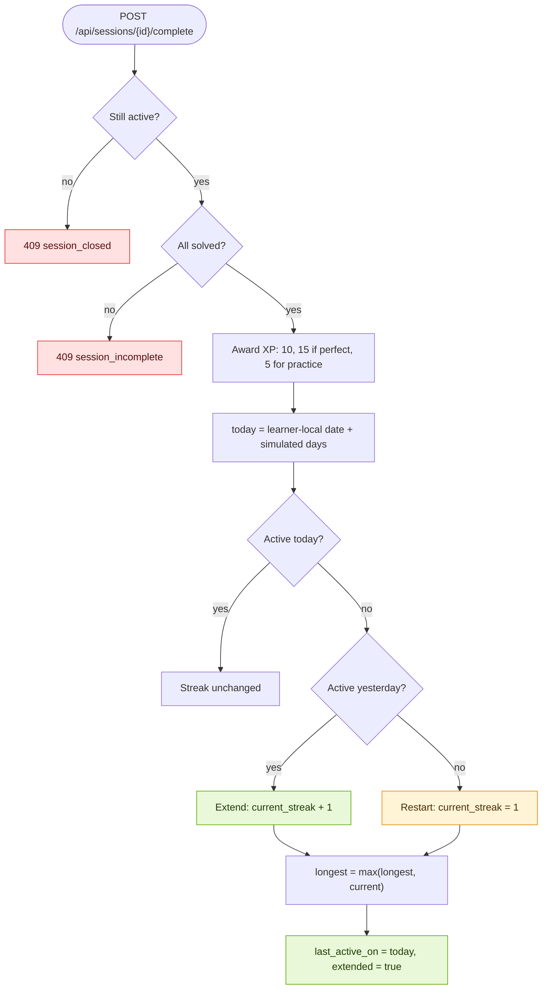
```mermaid
flowchart TD
    A(["POST /api/sessions/{id}/complete"]) --> B{"Still active?"}
    B -->|"no"| B1["409 session_closed"]
    B -->|"yes"| C{"All solved?"}
    C -->|"no"| C1["409 session_incomplete"]
    C -->|"yes"| D["Award XP: 10, 15 if perfect, 5 for practice"]
    D --> E["today = learner-local date + simulated days"]
    E --> F{"Active today?"}
    F -->|"yes"| F1["Streak unchanged"]
    F -->|"no"| G{"Active yesterday?"}
    G -->|"yes"| H["Extend: current_streak + 1"]
    G -->|"no"| I["Restart: current_streak = 1"]
    H --> J["longest = max(longest, current)"]
    I --> J
    J --> K["last_active_on = today, extended = true"]

    classDef good fill:#e8f8d8,stroke:#58a700,color:#1f3d00
    classDef bad fill:#ffe1e1,stroke:#ea2b2b,color:#5c0b0b
    classDef warm fill:#fff4d6,stroke:#e58600,color:#4d2e00
    class B1,C1 bad
    class H,K good
    class I warm
```

Every completed session counts, lesson or practice, because each one earns XP. The streak restarts at 1 on the very first session ever, or after one or more missed days. *Reading* the streak is separate and writes nothing: the stored count is shown while the last active day is today or yesterday, and 0 after that. A last active date that is *later* than today (for example after travelling west) still counts as active today, so the streak never moves backwards.

### Heart lifecycle

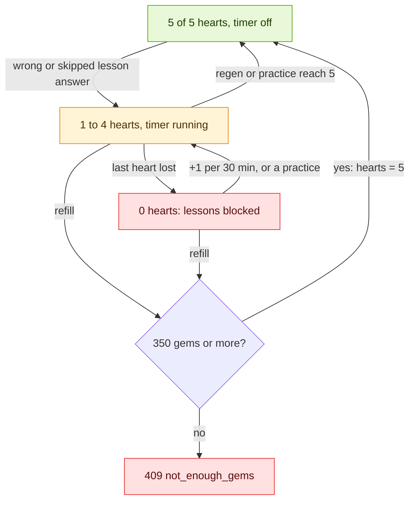
```mermaid
flowchart TD
    FULL["5 of 5 hearts, timer off"]
    SOME["1 to 4 hearts, timer running"]
    ZERO["0 hearts: lessons blocked"]
    GEMS{"350 gems or more?"}
    NOGEMS["409 not_enough_gems"]

    FULL -->|"wrong or skipped lesson answer"| SOME
    SOME -->|"last heart lost"| ZERO
    ZERO -->|"+1 per 30 min, or a practice"| SOME
    SOME -->|"regen or practice reach 5"| FULL
    SOME -->|"refill"| GEMS
    ZERO -->|"refill"| GEMS
    GEMS -->|"yes: hearts = 5"| FULL
    GEMS -->|"no"| NOGEMS

    classDef good fill:#e8f8d8,stroke:#58a700,color:#1f3d00
    classDef warm fill:#fff4d6,stroke:#e58600,color:#4d2e00
    classDef bad fill:#ffe1e1,stroke:#ea2b2b,color:#5c0b0b
    class FULL good
    class SOME warm
    class ZERO,NOGEMS bad
```

Each further mistake in a lesson costs another heart, and asking for a refill with full hearts returns `409 hearts_full`. Nothing runs in the background: each request works out how many full 30-minute intervals have passed since the timer's anchor (`users.hearts_refill_from`), credits them all at once and moves the anchor forward by the same amount. Only the first lost heart starts the timer; later losses keep it running. The frontend re-fetches `/api/me` the moment the next heart is due, correcting for any difference between the browser's clock and the server's.

### Achievements

<details>
<summary><b>All 9 achievements</b> (the seeded learner starts with the first three)</summary>
<br>

| # | Achievement | Requirement | Metric | Threshold |
| ---: | --- | --- | --- | ---: |
| 1 | 🐣 **First Steps** | Complete your first lesson | lessons completed | 1 |
| 2 | 🔥 **Wildfire** | Reach a 3 day streak | longest streak | 3 |
| 3 | 🦉 **Sage** | Earn 100 XP | total XP | 100 |
| 4 | 🎯 **Sharpshooter** | Complete 3 lessons without a mistake | perfect lessons | 3 |
| 5 | 👑 **Royalty** | Earn 5 crowns | crowns | 5 |
| 6 | 📅 **Week Warrior** | Reach a 7 day streak | longest streak | 7 |
| 7 | 📚 **Scholar** | Earn 500 XP | total XP | 500 |
| 8 | 🐛 **Bookworm** | Complete 25 lessons | lessons completed | 25 |
| 9 | 🏆 **Conqueror** | Earn 15 crowns | crowns | 15 |

*Lessons completed* counts every lesson completion, replays included (practice does not count). *Perfect lessons* counts completed lessons with no wrong attempt. The profile shows progress as `min(metric, threshold)` out of the threshold.

</details>

### Leaderboard details

The league is always **Bronze**. The "promotion zone" under the top five and the *"Top 5 advance to the next league"* line are part of the look; nobody is actually promoted. The week runs from Monday to today in the learner's time zone, and `days_left` counts down from 7 on Monday to 1 on Sunday.

<details>
<summary><b>The seeded rivals</b></summary>
<br>

| Rival | All-time XP | XP this week |
| --- | ---: | ---: |
| Sofía | 2,450 | 310 |
| Mateo | 1,980 | 265 |
| Lucía | 3,120 | 230 |
| Diego | 1,210 | 190 |
| Valentina | 890 | 160 |
| Hugo | 640 | 125 |
| Camila | 1,530 | 95 |
| Leo | 420 | 70 |
| Isabella | 760 | 45 |
| Daniel | 310 | 30 |
| Martina | 180 | 15 |
| Pablo | 95 | 0 |

Weekly XP is spread evenly from Monday to the day of seeding. Rivals do not earn XP after seeding, so their weekly totals drop to 0 once the (real or simulated) calendar reaches a new week. The demo learner's weekly XP depends on the weekday of seeding: on a Thursday it is 70 XP, rank 8.

</details>

### Demo learner and the simulated clock

The database is seeded on first start with **Alex** (`username = learner`): 135 XP, a **4-day streak** that has not been extended today yet, **4 of 5 hearts** (the next one arrives about 20 minutes after seeding), **1,000 gems**, a 20 XP daily goal, Greetings at level 2, People at level 1, *At the café* part-way through (next: lesson 2 of 3), and 3 of 9 achievements.

**Settings → Demo tools** talks to the dev routes:

- **Next day** moves the server clock forward one day. Any missing hearts are back (a day is far longer than 5 × 30 minutes), the daily goal resets, and the streak is still shown but no longer active today. Advancing two days without a lesson shows a streak of 0, and the next completion restarts it at 1; the longest streak is kept.
- **Reset demo data** (with a confirmation) wipes every table, sets the simulated offset back to 0 and reseeds relative to today in the browser's time zone.

---

## 📚 Course content

The course is **Spanish for English speakers**. Each skill is authored as 6 vocabulary words (with emoji illustrations), 6 example sentences with accepted alternative translations, and 3 fill-in-the-blank items. A lesson builder in `backend/app/seed/lessons.py` turns that material into three lessons per skill, deterministically, so every seed produces the same course.

### Exercise mix

<p align="center">
<picture>
  <source media="(prefers-color-scheme: dark)" srcset="docs/charts/exercise-mix-dark.svg">
  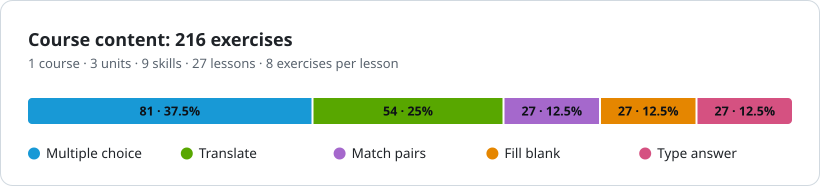
</picture>
</p>

| Type | Exercises | Share | Variants |
| --- | ---: | ---: | --- |
| Multiple choice | 81 | 37.5% | 54 picture cards, 27 "select the correct meaning" |
| Translate (word bank) | 54 | 25% | 27 Spanish → English, 27 English → Spanish |
| Match pairs | 27 | 12.5% | 5 pairs each |
| Fill in the blank | 27 | 12.5% | 3 choices each |
| Type the answer | 27 | 12.5% | Free text in Spanish |
| **Total** | **216** | **100%** | 72 per unit |

### The eight steps of every lesson

Every lesson ramps up the same way, from recognising words to producing a sentence unaided:

| Step | Exercise | Prompt | Example (Greetings, lesson 1) |
| ---: | --- | --- | --- |
| 1 | Picture choice | *Which one of these is "…"?* | "hello" → **hola** 👋, gracias 🙏, buenos días 🌅 |
| 2 | Picture choice | *Which one of these is "…"?* | "thank you" |
| 3 | Match pairs | *Tap the matching pairs* | hola, gracias, buenos días, buenas noches, sí |
| 4 | Translate to English | *Write this in English* | "Hola, Ana." → "Hello, Ana." (or "Hi, Ana.") |
| 5 | Fill in the blank | *Fill in the blank* | "___ días, Ana." → **Buenos** / Buenas / Hola |
| 6 | Select the meaning | *Select the correct meaning* | "Buenos días, señor." |
| 7 | Translate to Spanish | *Write this in Spanish* | "Good morning, sir." → "Buenos días, señor." |
| 8 | Type the answer | *Type this in Spanish* | "Hello, Ana." → "Hola, Ana." |

The 54 "translate to English" and "select the meaning" prompts are also read aloud.

### Units, skills and vocabulary

| Unit | Theme | Skill | Vocabulary |
| --- | --- | --- | --- |
| **1. Form basic sentences** | green | 👋 Greetings | hola (hello), gracias (thank you), buenos días (good morning), buenas noches (good night), sí (yes), no (no) |
| | | 🧑 People | el hombre (the man), la mujer (the woman), el niño (the boy), la niña (the girl), el bebé (the baby), la doctora (the doctor) |
| | | ☕ At the café | el café (the coffee), el agua (the water), el pan (the bread), la leche (the milk), la manzana (the apple), el té (the tea) |
| **2. Talk about family and pets** | purple | 👪 Family | la madre (the mother), el padre (the father), el hermano (the brother), la hermana (the sister), el abuelo (the grandfather), la abuela (the grandmother) |
| | | 🐶 Animals | el perro (the dog), el gato (the cat), el caballo (the horse), el pájaro (the bird), el pez (the fish), la vaca (the cow) |
| | | 🎨 Colors | rojo (red), azul (blue), verde (green), amarillo (yellow), negro (black), blanco (white) |
| **3. Get around town** | blue | 🏠 Places | la casa (the house), la escuela (the school), el hospital (the hospital), el parque (the park), la playa (the beach), el hotel (the hotel) |
| | | 🚆 Transport | el tren (the train), el avión (the plane), el coche (the car), el autobús (the bus), el barco (the boat), la bicicleta (the bicycle) |
| | | 🔢 Numbers | uno (one), dos (two), tres (three), cuatro (four), cinco (five), diez (ten) |

### How answers are graded

Typed and word-bank answers are normalised before comparison: Unicode NFC and case folding, apostrophes removed, punctuation (`. , ! ? ¿ ¡ ; : " “ ” « » ( ) -`) turned into spaces, and whitespace collapsed.

| Type | Correct when |
| --- | --- |
| Multiple choice, fill in the blank | The chosen option is the correct one |
| Translate (word bank) | The tiles all belong to the exercise, none repeats, and the joined sentence matches an accepted answer exactly (accents included) |
| Type the answer | It matches an accepted answer; or it matches once accents are removed, in which case it is accepted with *"Pay attention to the accents."* There is no other typo tolerance. |
| Match pairs | Every option is paired with itself and nothing else |
| Skip | Never; the solution is revealed and, in a lesson, a heart is lost |

After a wrong answer the feedback bar shows the correct option, the completed sentence for a blank, the full list of pairs, or the main accepted translation.

---

## 💾 Database schema

The full DDL is a single file, [`backend/app/schema.sql`](backend/app/schema.sql): **16 tables** in two halves, course content and learner state. Timestamps are stored as UTC ISO-8601 strings, and `*_on` / `*_date` columns are dates in the learner's time zone.

### Course content

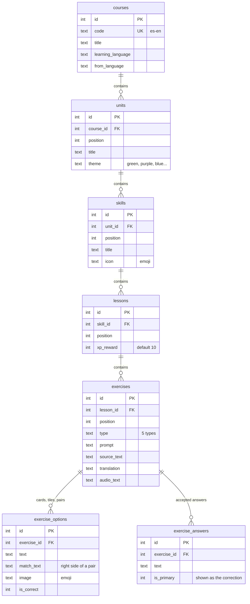
```mermaid
erDiagram
    courses ||--o{ units : contains
    units ||--o{ skills : contains
    skills ||--o{ lessons : contains
    lessons ||--o{ exercises : contains
    exercises ||--o{ exercise_options : "cards, tiles, pairs"
    exercises ||--o{ exercise_answers : "accepted answers"

    courses {
        int id PK
        text code UK "es-en"
        text title
        text learning_language
        text from_language
    }
    units {
        int id PK
        int course_id FK
        int position
        text title
        text theme "green, purple, blue..."
    }
    skills {
        int id PK
        int unit_id FK
        int position
        text title
        text icon "emoji"
    }
    lessons {
        int id PK
        int skill_id FK
        int position
        int xp_reward "default 10"
    }
    exercises {
        int id PK
        int lesson_id FK
        int position
        text type "5 types"
        text prompt
        text source_text
        text translation
        text audio_text
    }
    exercise_options {
        int id PK
        int exercise_id FK
        text text
        text match_text "right side of a pair"
        text image "emoji"
        int is_correct
    }
    exercise_answers {
        int id PK
        int exercise_id FK
        text text
        int is_primary "shown as the correction"
    }
```

Children are ordered by a `position` that is `UNIQUE` within their parent. Type-specific data lives in two child tables rather than a JSON blob: `exercise_options` holds one row per picture card, choice, word-bank tile or pair, and `exercise_answers` holds the accepted translations, one of them marked primary. Partial unique indexes allow **at most one correct option** and **at most one primary answer** per exercise.

### Learner state

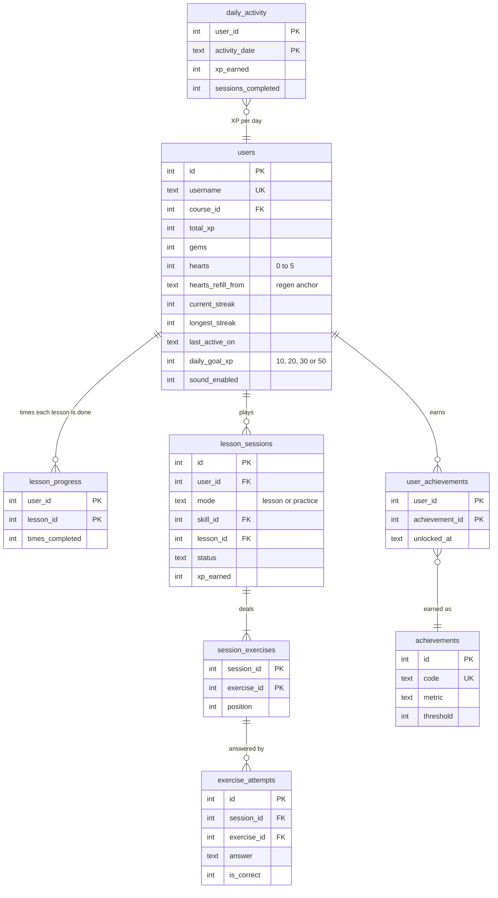
```mermaid
erDiagram
    daily_activity }o--|| users : "XP per day"
    users ||--o{ lesson_progress : "times each lesson is done"
    users ||--o{ lesson_sessions : plays
    users ||--o{ user_achievements : earns
    lesson_sessions ||--|{ session_exercises : deals
    session_exercises ||--o{ exercise_attempts : "answered by"
    user_achievements }o--|| achievements : "earned as"

    daily_activity {
        int user_id PK
        text activity_date PK
        int xp_earned
        int sessions_completed
    }
    users {
        int id PK
        text username UK
        int course_id FK
        int total_xp
        int gems
        int hearts "0 to 5"
        text hearts_refill_from "regen anchor"
        int current_streak
        int longest_streak
        text last_active_on
        int daily_goal_xp "10, 20, 30 or 50"
        int sound_enabled
    }
    lesson_progress {
        int user_id PK
        int lesson_id PK
        int times_completed
    }
    lesson_sessions {
        int id PK
        int user_id FK
        text mode "lesson or practice"
        int skill_id FK
        int lesson_id FK
        text status
        int xp_earned
    }
    session_exercises {
        int session_id PK
        int exercise_id PK
        int position
    }
    exercise_attempts {
        int id PK
        int session_id FK
        int exercise_id FK
        text answer
        int is_correct
    }
    user_achievements {
        int user_id PK
        int achievement_id PK
        text unlocked_at
    }
    achievements {
        int id PK
        text code UK
        text metric
        int threshold
    }
```

A few keys point back to the course content and are left out of the drawing to keep it readable: `users.course_id` references `courses`, `lesson_progress.lesson_id` and `lesson_sessions.lesson_id` reference `lessons`, `lesson_sessions.skill_id` references `skills`, and `session_exercises.exercise_id` references `exercises`. The sixteenth table, `app_state`, is a standalone key/value store.

| Table | Purpose |
| --- | --- |
| `users` | Profile, total XP, gems, hearts and their regeneration anchor, streak counters, daily goal and sound setting. Also linked to the learner's course. |
| `lesson_progress` | How many times each learner finished each lesson: the single source for crowns, rings and unlocks. |
| `lesson_sessions` | One play-through of a lesson or a practice round, with its mode, status and XP. |
| `session_exercises` | The exercises dealt into a session, in play order (authored order for lessons, a random sample for practice). |
| `exercise_attempts` | Every graded answer. Accuracy and "perfect lesson" are derived from here. |
| `daily_activity` | A per-day XP ledger that feeds the daily goal, the streak week and the weekly leaderboard. |
| `achievements` / `user_achievements` | The catalogue of thresholds on a metric, and when each learner unlocked each one. |
| `app_state` | A small key/value store; it holds the simulated day offset. |

**Integrity rules enforced by the database itself**

- `CHECK` constraints keep hearts between 0 and 5, `longest_streak >= current_streak`, totals non-negative, positions positive and every enum (`type`, `mode`, `status`, `theme`, `metric`, daily goal) within its allowed values.
- `CHECK ((mode = 'lesson') = (lesson_id IS NOT NULL))` ties lesson mode to a lesson, while whole-course practice has neither a skill nor a lesson.
- A **composite foreign key** from `exercise_attempts (session_id, exercise_id)` to `session_exercises` makes it impossible to record an attempt for an exercise that was never dealt into that session.
- Foreign keys are switched on for every SQLite connection, and child rows are deleted with their parent (`ON DELETE CASCADE`).
- `users.total_xp` is a deliberate running total, updated in the same transaction as the daily ledger, so the profile and the all-time leaderboard never scan history.

<details>
<summary><b>Row counts after a fresh seed</b></summary>
<br>

| Table | Rows | | Table | Rows |
| --- | ---: | --- | --- | ---: |
| `courses` | 1 | | `users` | 13 |
| `units` | 3 | | `lesson_progress` | 7 |
| `skills` | 9 | | `lesson_sessions` | 0 |
| `lessons` | 27 | | `session_exercises` | 0 |
| `exercises` | 216 | | `exercise_attempts` | 0 |
| `exercise_options` | 823 | | `daily_activity` | 18 to 84* |
| `exercise_answers` | 123 | | `achievements` | 9 |
| | | | `user_achievements` | 3 |
| | | | `app_state` | 0 |

\* The rivals' weekly XP is spread over the days since Monday, so this depends on the weekday of seeding: 18 rows on a Monday, 51 on a Thursday, 84 on a Sunday.

</details>

---

## 🔌 API reference

The API is served by FastAPI. Every endpoint except the health check lives under `/api` and acts as the seeded learner (there is no sign-in). Interactive docs with full schemas are at **`/docs`** (and `/redoc`); they list Aishwary Srivastava as the API's contact.

| Method | Path | Description | Errors |
| --- | --- | --- | --- |
| `GET` `HEAD` | `/health` | Keep-alive and uptime probe: `{"status": "ok"}`. No database, no auth. | |
| `GET` | `/api/me` | Learner stats: XP, gems, hearts and next heart time, streak and week, daily goal, settings, server time | |
| `PATCH` | `/api/me/settings` | Update `display_name` (1 to 30 characters), `daily_goal_xp` (10/20/30/50) or `sound_enabled` | 422 |
| `POST` | `/api/me/hearts/refill` | Spend 350 gems to refill hearts to 5 | 409 `hearts_full`, `not_enough_gems` |
| `GET` | `/api/me/profile` | Statistics, course progress and achievements with progress | |
| `GET` | `/api/path` | Units and skills with state, crown level and ring progress | |
| `GET` | `/api/units/{unit_id}/guidebook` | A unit's key words and phrases | 404 `unit_not_found` |
| `POST` | `/api/sessions` | Start `{"mode": "lesson" or "practice", "skill_id": 3}`; returns the session with its exercises (201) | 403 `skill_locked`, 404 `skill_not_found`, 409 `skill_legendary`, `out_of_hearts`, `nothing_to_practice`, 422 `skill_required` |
| `POST` | `/api/sessions/{id}/answers` | Grade `{"exercise_id", "answer": {...}}`; returns correctness, solution, note and hearts | 404 `session_not_found`, `exercise_not_in_session`, 409 `session_closed`, `out_of_hearts`, 422 `answer_type_mismatch` |
| `POST` | `/api/sessions/{id}/complete` | Award XP, streak, progress and achievements; returns the completion summary | 404 `session_not_found`, 409 `session_closed`, `session_incomplete` |
| `POST` | `/api/sessions/{id}/abandon` | Close a session the learner quit (204, safe to repeat) | 404 `session_not_found` |
| `GET` | `/api/leaderboard?period=week\|all` | Ranked learners, league, days left and promotion cutoff | |
| `GET` | `/api/dev/clock` | Simulated date and day offset (demo only) | |
| `POST` | `/api/dev/advance-day` | `{"days": 1}` (1 to 30) moves the simulated clock forward (demo only) | |
| `POST` | `/api/dev/reset` | Wipe and reseed all data (demo only) | |

The three `/api/dev` routes exist only while `ENABLE_DEV_ROUTES` is on; the Settings page hides its demo tools when they are missing.

### Answer payloads

Answers are a discriminated union on `type`:

```jsonc
{ "type": "multiple_choice", "option_id": 12 }
{ "type": "fill_blank",      "option_id": 40 }
{ "type": "translate",       "option_ids": [51, 53, 52] }   // tiles in order, 1 to 30
{ "type": "match_pairs",     "pairs": [[61, 61], [62, 62]] } // [left option, right option], 1 to 10
{ "type": "type_answer",     "text": "Gracias, adios" }      // up to 300 characters
{ "type": "skip" }
```

A typed answer that is only missing accents comes back as correct, with a note:

```json
{
  "correct": true,
  "solution": "Gracias, adiós.",
  "note": "Pay attention to the accents.",
  "hearts": { "count": 4, "max": 5, "next_heart_at": "2026-10-08T12:20:00Z", "regen_minutes": 30, "refill_cost_gems": 350 },
  "out_of_hearts": false
}
```

### Errors

Every application error has the same shape, with a stable `code` that the UI branches on:

```json
{ "error": { "code": "out_of_hearts", "message": "You ran out of hearts. Refill or practice to earn more." } }
```

| Status | Codes |
| --- | --- |
| 403 | `skill_locked` |
| 404 | `session_not_found`, `skill_not_found`, `exercise_not_in_session`, `unit_not_found`, `user_not_found` |
| 409 | `session_closed`, `session_incomplete`, `skill_legendary`, `out_of_hearts`, `nothing_to_practice`, `hearts_full`, `not_enough_gems` |
| 422 | `answer_type_mismatch`, `invalid_display_name`, `skill_required` |
| 500 | `internal_error` (logged on the server; the response keeps its CORS headers) |
| 503 | `not_seeded` |

Request bodies that fail Pydantic validation get FastAPI's standard `422 {"detail": [...]}` response. On the client, `lib/api.ts` turns every failure into an `ApiError(status, code, message)`. When the API cannot be reached at all, the message explains the two most common deployment mistakes: an API URL still pointing at `localhost`, or an `http://` API behind an `https://` site.

---

## 📁 Project structure

```text
DuolingoClone/
├── backend/
│   ├── app/
│   │   ├── main.py            app factory: middleware, routers, first-run seeding
│   │   ├── config.py          environment variables and their validation
│   │   ├── database.py        SQLite or Turso connection, transaction(), write lock
│   │   ├── clock.py           real time + simulated day offset, learner time zone
│   │   ├── dependencies.py    per-request connection, clock and learner
│   │   ├── errors.py          AppError, JSON error handlers, UnhandledErrorMiddleware
│   │   ├── rules.py           balance constants (hearts, XP, crowns, daily goals)
│   │   ├── schema.sql         the whole database schema
│   │   ├── schemas.py         Pydantic request and response models
│   │   ├── routers/           health, me, course, sessions, leaderboard, dev
│   │   ├── services/          sessions, learner, path, achievements, leaderboard,
│   │   │                      guidebook, and the pure hearts, streaks, grading rules
│   │   └── seed/              content.py (course material), lessons.py (lesson builder), seeder.py
│   ├── scripts/init_db.py     check the connection, create missing tables, seed or reset
│   ├── tests/                 71 pytest cases in 6 files
│   ├── requirements.txt       pinned runtime dependencies
│   ├── requirements-dev.txt   adds pytest and the test client's HTTP library
│   └── .env.example           backend settings template
├── frontend/
│   ├── src/
│   │   ├── app/               routes: (app)/ shell pages, lesson/[skillId], practice, not-found
│   │   ├── components/        shell/, path/, lesson/ (+ exercises/), contact/, widgets/, ui/
│   │   ├── context/           UserContext, ToastContext, ThemeContext
│   │   ├── hooks/             useLessonEngine, useApiResource, useHeartRefill, useNow, ...
│   │   └── lib/               api client, types, author, sounds, speech, quests, formatting
│   ├── next.config.ts         security headers
│   └── .env.example           NEXT_PUBLIC_API_URL
├── docs/
│   ├── screenshots/           README screenshots, banner and demo GIF
│   ├── charts/                README charts (light and dark SVG)
│   └── keep-alive.md          keeping the free Render backend awake
├── .github/workflows/
│   └── keep-alive.yml         pings /health every 10 minutes
└── render.yaml                Render blueprint for the backend
```

---

## 🚀 Getting started

**Prerequisites:** Python 3.11+ and Node.js 20+.

### 1. Backend (http://localhost:8000)

```bash
cd backend
python -m venv .venv
source .venv/bin/activate            # Windows: .venv\Scripts\activate
pip install -r requirements-dev.txt
uvicorn app.main:app --reload --port 8000
```

By default the backend uses a local SQLite file (`backend/data/duolingo.db`), which is created and seeded automatically on first start. Settings can also go in `backend/.env` (template: [`backend/.env.example`](backend/.env.example)). The interactive API docs are at http://localhost:8000/docs.

To wipe and reseed at any time:

```bash
python -m app.seed                   # optional: --timezone Asia/Kolkata
```

### 2. Frontend (http://localhost:3000)

```bash
cd frontend
cp .env.example .env.local           # NEXT_PUBLIC_API_URL=http://localhost:8000
npm install
npm run dev
```

Open http://localhost:3000. You are the seeded learner **Alex**, with a 4-day streak, 4 of 5 hearts, two crowned skills and *At the café* in progress.

> [!TIP]
> To see streaks and hearts change without waiting a day, open **Settings → Demo tools** and press **Next day**. **Reset demo data** restores the seed.

### 3. Database: Turso (cloud SQLite)

Render's free tier wipes the local disk on every restart, so in production the backend stores its data in a [Turso](https://turso.tech) database. The schema and queries are the same; only the connection changes.

Get the two values with the [Turso CLI](https://docs.turso.tech/cli/introduction) (`brew install tursodatabase/tap/turso`, or `curl -sSfL https://get.tur.so/install.sh | bash`). The Turso dashboard can also copy a database's URL and create a token.

```bash
turso auth login
turso db create duolingo-clone             # pick a location close to your backend host
turso db show duolingo-clone --url         # → TURSO_DATABASE_URL  (libsql://…turso.io)
turso db tokens create duolingo-clone      # → TURSO_AUTH_TOKEN
```

Test the connection locally:

```bash
cd backend
cp .env.example .env                       # paste both values into backend/.env
python scripts/init_db.py                  # connect, create missing tables, seed if empty
uvicorn app.main:app --reload --port 8000  # logs "Database: Turso (libsql://…)"
```

`init_db.py` reports the round-trip latency, which tables it created, whether foreign keys are enforced and the row counts, and exits with a hint on a bad URL or token. `--reset` wipes and reseeds (it asks first unless you pass `--yes`). Leave both variables empty to fall back to the local SQLite file. If Turso is configured but unreachable, the API refuses to start rather than silently writing to a throwaway local file.

### Configuration

| Variable | Where | Default | Purpose |
| --- | --- | --- | --- |
| `NEXT_PUBLIC_API_URL` | frontend | `http://localhost:8000` | Backend base URL (baked in at build time) |
| `TURSO_DATABASE_URL` | backend | unset | Turso database URL; when set it replaces the local SQLite file |
| `TURSO_AUTH_TOKEN` | backend | unset | Turso database auth token |
| `DATABASE_PATH` | backend | `backend/data/duolingo.db` | Local SQLite file, used when Turso isn't configured |
| `CORS_ORIGINS` | backend | `http://localhost:3000`,<br>`http://127.0.0.1:3000` | Allowed frontend origins, comma-separated (trailing slashes are ignored) |
| `CORS_ORIGIN_REGEX` | backend | unset | Extra origin pattern, e.g. for Vercel preview deployments (see below) |
| `HEART_REGEN_MINUTES` | backend | `30` | Minutes to regenerate one heart (a whole number ≥ 1; anything else stops startup) |
| `DEFAULT_USERNAME` | backend | `learner` | The seeded learner every request acts as |
| `ENABLE_DEV_ROUTES` | backend | `true` | Expose `/api/dev/*` (next day, reset). When `false`, Settings hides the demo tools |

To let a project's Vercel preview deployments call the API, scope `CORS_ORIGIN_REGEX` to your own team, for example `https://duolingo-clone-[a-z0-9-]+-<team>\.vercel\.app`. Avoid `https://.*\.vercel\.app`, which would allow every site hosted on Vercel.

---

## 🧪 Testing and quality

### Backend tests

<p align="center">
<picture>
  <source media="(prefers-color-scheme: dark)" srcset="docs/charts/tests-dark.svg">
  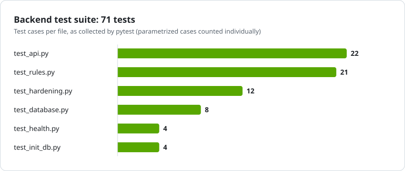
</picture>
</p>

| File | Tests | What it covers |
| --- | ---: | --- |
| `test_api.py` | 22 | Full API flows on a freshly seeded database: answer keys hidden from the session payload, locked skills, the perfect-lesson bonus, heart loss with re-queued mistakes, running out of hearts and resuming after a refill, practice without hearts restoring one, crowns and unlocking, double-complete protection, a new session abandoning the old one, answer-type mismatch, streaks across simulated days, the daily goal reported once, achievements, profile stats, settings validation, leaderboard ranking, guidebook, reset and CORS |
| `test_rules.py` | 21 | The pure rules: hearts (regeneration per interval, cap, next heart time, never below 0), streaks (start, extend, same day, missed day, longest, visible until the end of the next day) and grading (normalisation, alternatives, accent note, word-bank order, fill-in-the-blank solution, all pairs required, skip) |
| `test_hardening.py` | 12 | Malformed `X-Timezone` headers fall back to UTC, unexpected 500s are JSON with CORS headers, streaks survive a time zone moving west, `last_active_on` never moves backwards, trailing slashes in CORS origins, invalid `HEART_REGEN_MINUTES` values stop startup |
| `test_database.py` | 8 | The libSQL adapter behaves like `sqlite3`: named parameters, rows, batched inserts, commit and rollback, a failed rollback not hiding the original error, schema and seed through the adapter, and the SQLite fallback |
| `test_health.py` | 4 | `/health` answers GET and HEAD, never touches the database and passes CORS |
| `test_init_db.py` | 4 | `scripts/init_db.py` creates and seeds an empty database, only verifies on a second run, asks before a reset and reports an unreachable Turso |
| **Total** | **71** | |

```bash
# backend: 71 tests on a fresh temporary SQLite database per test
cd backend && pytest

# the same suite against a libSQL server, e.g. a throwaway Turso database or `turso dev`
# (it is wiped for every test, so never point it at real data)
TEST_TURSO_DATABASE_URL=http://127.0.0.1:8080 TEST_TURSO_AUTH_TOKEN= pytest

# frontend: strict type check and lint (and the production build that Vercel runs)
cd frontend && npm run typecheck && npm run lint
npm run build
```

### Security and hardening

| Measure | Where | Detail |
| --- | --- | --- |
| Security headers | `frontend/next.config.ts` | `Content-Security-Policy: frame-ancestors 'none'`, `X-Frame-Options: DENY`, `X-Content-Type-Options: nosniff`, `Referrer-Policy: strict-origin-when-cross-origin`, and a `Permissions-Policy` that disables camera, microphone, geolocation and payment. The `X-Powered-By` header is off. |
| CORS | `backend/app/main.py` | An explicit origin list (trailing slashes stripped) and an optional, narrowly scoped regex. Only `GET`, `POST` and `PATCH`, and only the `Content-Type` and `X-Timezone` headers. |
| Answer keys withheld | `backend/app/schemas.py` | Options are sent as `id`, `text`, `image` and `match_text` only, shuffled on every deal. A test asserts the session payload has no correctness flags. |
| Server-side grading | `services/sessions.py`, `services/grading.py` | One active session per learner, ownership checks, exercises must belong to the session, the answer type must match, and completion requires every exercise solved. |
| Input validation | Pydantic models | Up to 30 word tiles, 10 pairs and 300 typed characters; display names 1 to 30 characters; daily goal from a fixed list; `days` 1 to 30. |
| Configuration checks | `backend/app/config.py` | An invalid `HEART_REGEN_MINUTES` stops startup with a clear message. |
| Time zone header | `backend/app/clock.py` | Capped at 64 characters; unknown or malformed zones (including path-like values) fall back to UTC. |
| Transactions | `backend/app/database.py` | `BEGIN IMMEDIATE` on every write, a rollback that never hides the original error, foreign keys on, WAL mode and a 5-second busy timeout for SQLite. |
| Dependencies | `frontend/package.json` | Next.js and React are pinned, and PostCSS is pinned to a patched release through `overrides`. |

### Accessibility

- Dialogs use `role="dialog"`, `aria-modal` and `aria-labelledby`, render in a portal and close on <kbd>Esc</kbd> or an outside click.
- Toasts live in an `aria-live="polite"` region; loading screens and feedback praise use `role="status"`.
- The progress bar is a `progressbar` with value attributes, toggles are `switch`es, the daily goal is a `radiogroup` and the leaderboard periods are `tab`s.
- Full keyboard play: number keys for options, <kbd>Enter</kbd> to check and continue, <kbd>Backspace</kbd> for word tiles, and a visible `:focus-visible` outline everywhere.
- Continue buttons and the typing box receive focus automatically when they appear.
- The contact form marks invalid fields with `aria-invalid` and links their error messages with `aria-describedby`.
- `prefers-reduced-motion` cuts animations and transitions to almost nothing.

### Performance and UX touches

- **No background jobs, no polling:** hearts are computed on read, and the client schedules a single re-fetch for the moment the next heart is due.
- **Server-corrected countdowns:** `/api/me` returns the server time, so countdowns stay right even when the browser's clock is off or the demo clock has been moved forward.
- **Honest loading states:** a bobbing-owl loading screen, error screens with a retry button, and stale responses ignored when the learner navigates quickly.
- **Cold-start hint:** if the API takes more than 4 seconds, the loading screen explains that the free server is waking up and the first visit can take up to a minute.
- **No asset downloads for sound or speech:** sounds are synthesised with Web Audio and prompts are spoken with the browser's speech synthesis.
- **Instant feedback where it is safe:** mismatched match pairs shake immediately in the browser; everything that changes progress waits for the server.

### Codebase

<p align="center">
<picture>
  <source media="(prefers-color-scheme: dark)" srcset="docs/charts/codebase-dark.svg">
  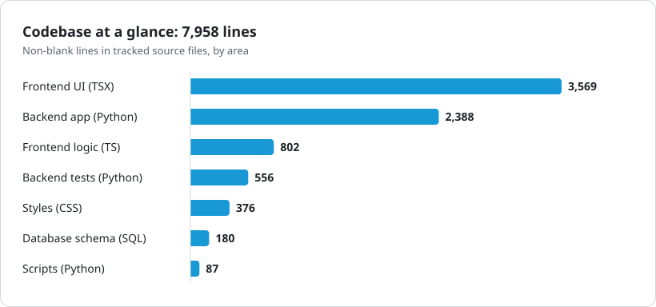
</picture>
</p>

| Area | Language | Non-blank lines |
| --- | --- | ---: |
| Frontend UI | TSX | 3,569 |
| Backend app | Python | 2,388 |
| Frontend logic | TypeScript | 802 |
| Backend tests | Python | 556 |
| Styles | CSS | 376 |
| Database schema | SQL | 180 |
| Scripts | Python | 87 |
| **Total** | | **7,958** |

---

## 🌐 Deployment

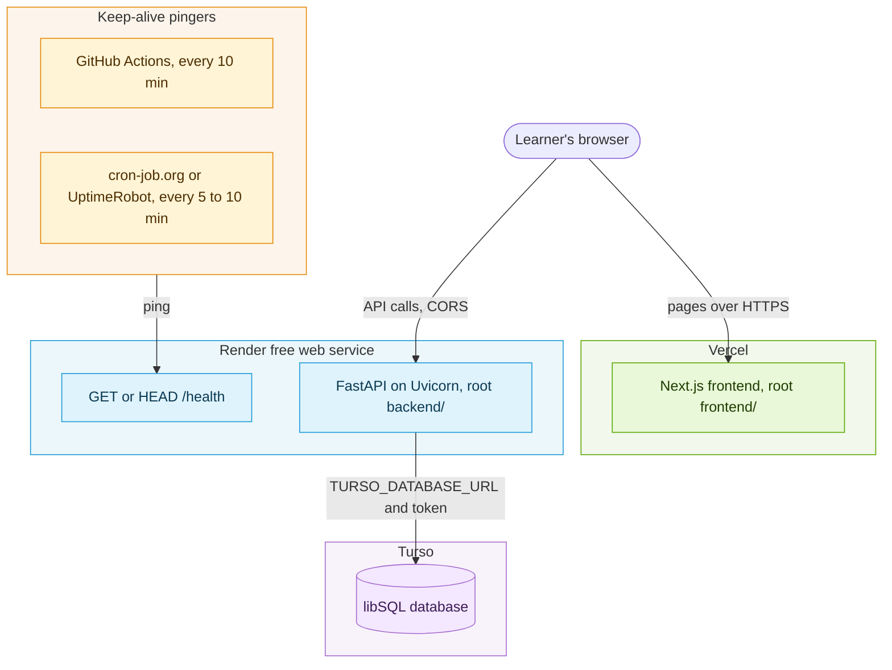
```mermaid
flowchart TB
    subgraph K["Keep-alive pingers"]
        gha["GitHub Actions, every 10 min"]
        monitor["cron-job.org or UptimeRobot, every 5 to 10 min"]
    end
    learner(["Learner's browser"])

    subgraph V["Vercel"]
        web["Next.js frontend, root frontend/"]
    end

    subgraph R["Render free web service"]
        health["GET or HEAD /health"]
        api["FastAPI on Uvicorn, root backend/"]
    end

    subgraph T["Turso"]
        db[("libSQL database")]
    end

    K -->|"ping"| health
    learner -->|"API calls, CORS"| api
    learner -->|"pages over HTTPS"| web
    api -->|"TURSO_DATABASE_URL and token"| db

    classDef fe fill:#e8f8d8,stroke:#58a700,color:#1f3d00
    classDef be fill:#dff3fd,stroke:#1899d6,color:#0b3a52
    classDef dbc fill:#f3e8ff,stroke:#a568cc,color:#3d1a57
    classDef ping fill:#fff4d6,stroke:#e58600,color:#4d2e00
    class web fe
    class api,health be
    class db dbc
    class gha,monitor ping
    style K fill:#e5860014,stroke:#e58600
    style V fill:#58a70014,stroke:#58a700
    style R fill:#1899d614,stroke:#1899d6
    style T fill:#a568cc14,stroke:#a568cc
```

The pages come from Vercel, but the browser calls the Render API directly, which is why the API's `CORS_ORIGINS` must list the Vercel URL. Render keeps no state of its own: all data lives in Turso.

**Backend on Render.** [`render.yaml`](render.yaml) is a ready blueprint: a free Python web service in the `backend/` root directory, Python 3.12.7, `pip install -r requirements.txt`, `uvicorn app.main:app --host 0.0.0.0 --port $PORT` and a health check on `/health`. Set `CORS_ORIGINS` to the frontend URL, and `TURSO_DATABASE_URL` / `TURSO_AUTH_TOKEN` so progress lives in Turso and survives restarts and deploys. Tables are created on startup; running `python scripts/init_db.py` locally with the same values first confirms the connection. Any host that runs a Python web process works the same way.

**Frontend on Vercel.** Import the repository, set the **Root Directory** to `frontend` and add `NEXT_PUBLIC_API_URL=https://<your-backend>`. The value is baked in at build time, so redeploy after changing it.

**Database on Turso.** Create the database in the region closest to the backend (the blueprint uses Render's Oregon region); every query is a network round trip.

**Keeping the backend awake.** Render's free tier spins a service down after 15 idle minutes, and the next visitor waits for a cold start. A GitHub Actions workflow ([`keep-alive.yml`](.github/workflows/keep-alive.yml)) pings `/health` every 10 minutes, with up to two retries and a 60-second timeout, and reports each run in the Actions summary. An external monitor (cron-job.org or UptimeRobot) is the backup for when scheduled runs are delayed. Setup takes a few minutes: [`docs/keep-alive.md`](docs/keep-alive.md).

> [!IMPORTANT]
> `ENABLE_DEV_ROUTES` is on by default so the demo tools work, which means anyone with the URL can move the clock or reset the data. Set `ENABLE_DEV_ROUTES=false` on a public deployment whose data you want to keep.

---

## 🧭 Assumptions, limitations and roadmap

**Assumptions and known limitations**

- **No sign-in.** Every request acts as the seeded learner (`username = learner`). The schema is multi-user, so adding authentication only changes how `get_learner_id` picks the learner.
- **One course.** Spanish for English speakers: 3 units, 9 skills, 27 lessons, 216 exercises. Higher crown levels replay the same lessons rather than harder ones.
- **Gems are a mocked currency.** They are spent on heart refills but never earned, and there are no real payments.
- **Quests and leagues are cosmetic.** Quests grant no rewards, the league is always Bronze and nobody is promoted, and the seeded rivals do not earn XP after seeding.
- **Audio is one-way.** Prompts are spoken with the browser's text-to-speech; there are no listening-only or speaking exercises.
- **Typed answers forgive accents only.** Case and punctuation are ignored, but there is no typo tolerance beyond missing accents.
- **Dark mode is per device** (`localStorage`); every other setting is stored per learner.
- **The contact form uses `mailto:`.** It needs an email app on the visitor's device; the site itself sends nothing.
- **Modals close on Esc but do not trap focus** or restore it to the triggering button yet.
- **Frontend checks are static.** The frontend is covered by strict type checking and linting; there is no browser test suite or CI test workflow yet.
- **Original artwork.** The owl mascot and icons are original SVGs, and Nunito stands in for Duolingo's proprietary typeface.

**Roadmap: coming soon**

| In the app as "Coming soon" | Ideas for later |
| --- | --- |
| 🧊 Streak Freeze power-up | Accounts and sign-in, with several learners per deployment |
| 🎲 Double or Nothing wager | More courses and harder content at higher crown levels |
| ❤️ Unlimited hearts (Super) | Real league promotion and weekly resets with live rivals |
| 🔔 Practice reminders and streak alerts | Rewards for completed quests and ways to earn gems |
| 🔒 Privacy settings | Listening and speaking exercises |
| ❓ Help center | Focus trapping in dialogs, browser tests and a CI workflow |

---

## 👤 Author and contact

<div align="center">

<h3>Aishwary Srivastava</h3>

<p>Designer and developer of this Duolingo Clone<br>
🎓 Thapar Institute of Engineering and Technology<br>
✉️ <a href="mailto:asrivastava1_be23@thapar.edu">asrivastava1_be23@thapar.edu</a></p>

<p><sub>The live site has a <b>Contact</b> page (<code>/contact</code>) with a copy-email button and a message form that opens your email app.</sub></p>

</div>

Feedback, bug reports and ideas are very welcome: open an issue, or write an email. Hearing which part of the clone you enjoyed most, or which Duolingo feature you would like to see next, is always appreciated.

---

<div align="center">
<sub>© 2026 Aishwary Srivastava</sub><br>
<sub>Duolingo is a trademark of Duolingo, Inc. This independent project is not affiliated with, endorsed by or sponsored by Duolingo, Inc.</sub>
</div>
