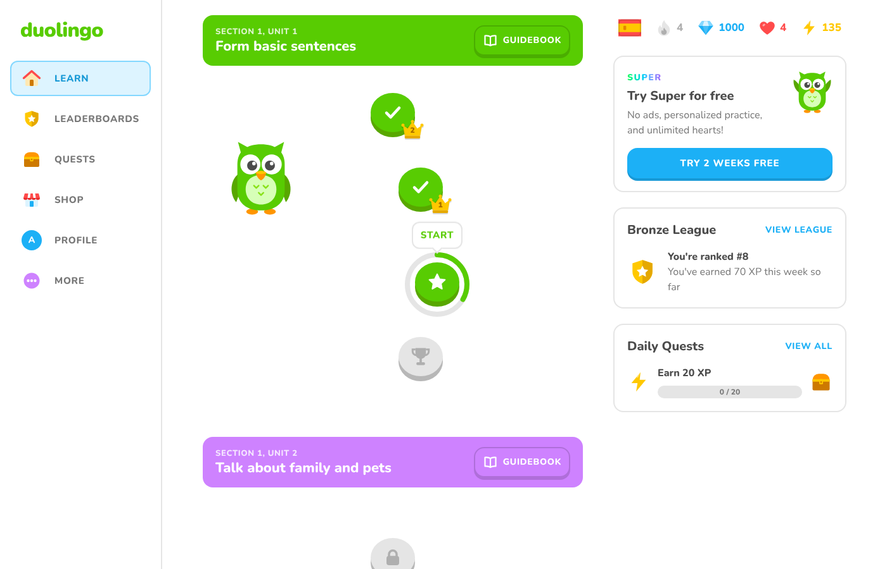
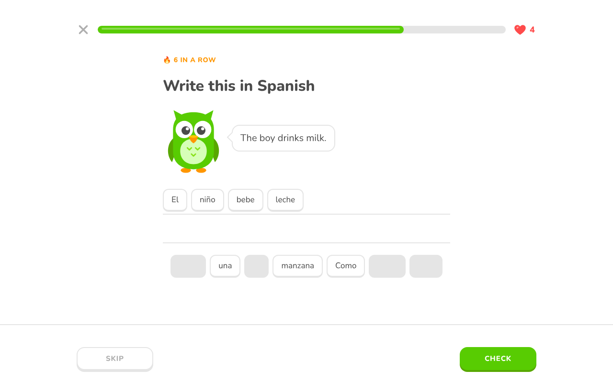
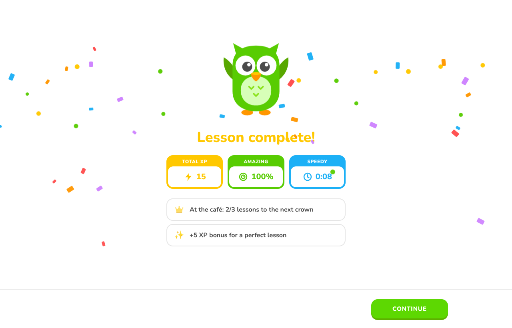
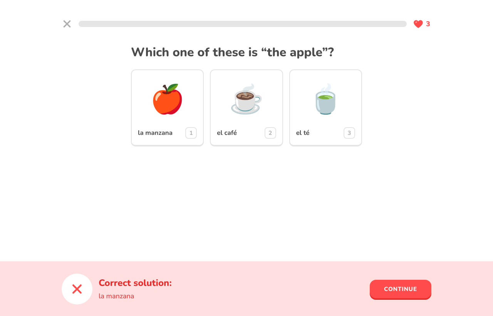
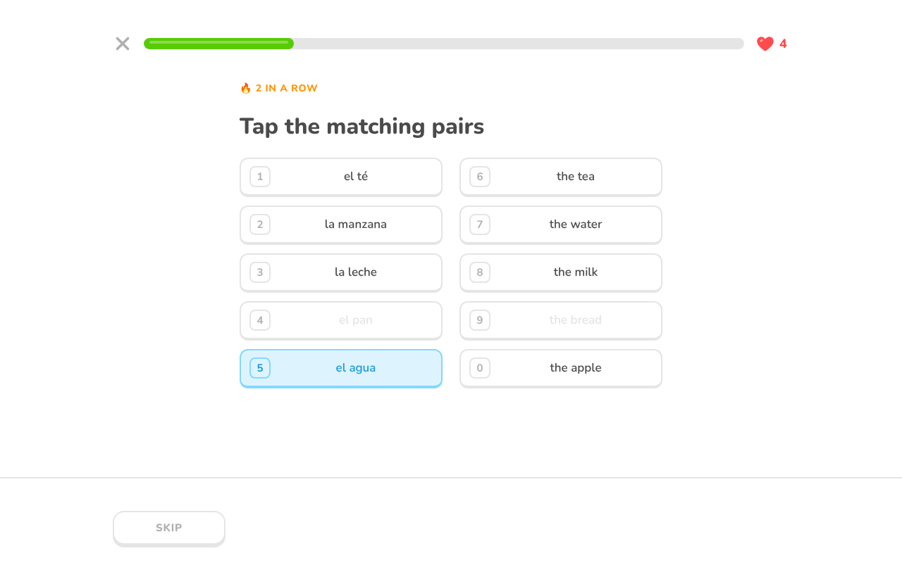
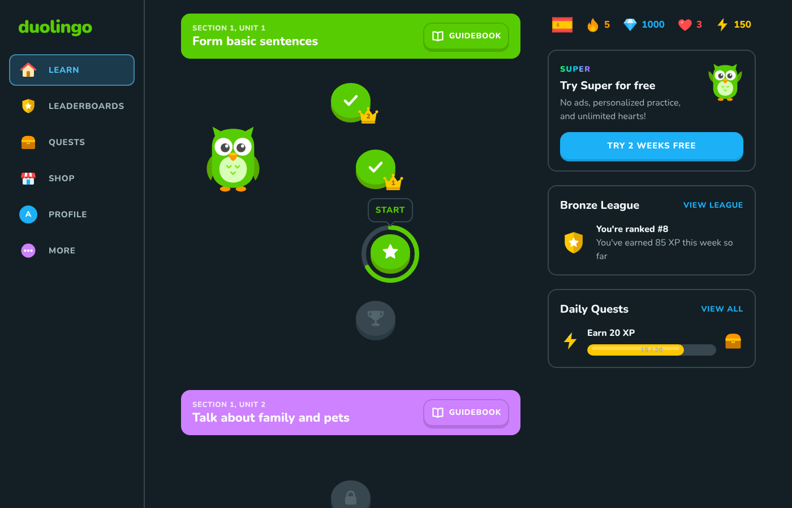
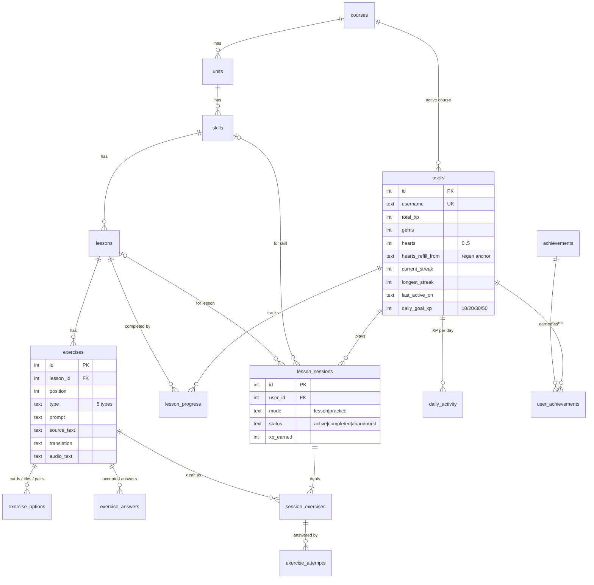
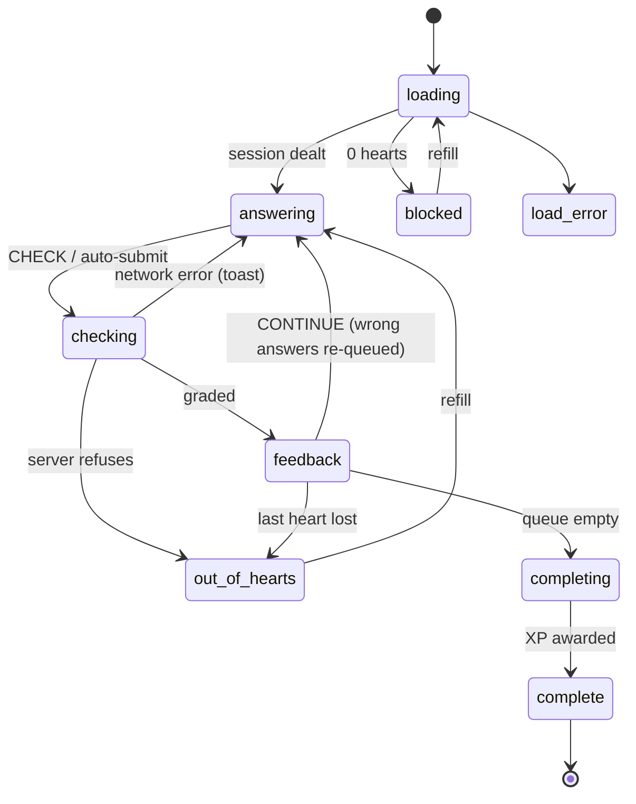

# Duolingo Clone

A full-stack recreation of the Duolingo web app: the learning path, the lesson
player and the gamification loop (XP, streaks, hearts, crowns, daily goal,
leaderboard, achievements), built with **Next.js + TypeScript**, **FastAPI** and
**SQLite**.

| Learning path | Lesson player | Lesson complete |
| :---: | :---: | :---: |
|  |  |  |
| **Feedback bar** | **Match pairs** | **Mobile + dark mode** |
|  |  |  |

More screens live in [`docs/screenshots`](docs/screenshots).

---

## Contents

1. [Features](#features)
2. [Tech stack](#tech-stack)
3. [Getting started](#getting-started)
4. [Architecture](#architecture)
5. [Database schema](#database-schema)
6. [Gamification rules](#gamification-rules)
7. [Lesson player state machine](#lesson-player-state-machine)
8. [API overview](#api-overview)
9. [Testing](#testing)
10. [Deployment](#deployment)
11. [Assumptions and limitations](#assumptions-and-limitations)

---

## Features

**Learning path / skill tree**
- Units rendered as Duolingo's winding path, with sticky coloured unit headers and a **Guidebook** (key words and phrases, with text-to-speech).
- Skill nodes in **locked**, **active** and **completed** states, a **progress ring** for lessons done at the current level, **crown badges** (levels 1–5, gold "legendary" at 5), a bouncing **START** bubble and a unit **trophy**.
- Node popovers: *Start +10 XP*, *Practice +5 XP*, or *Locked*.

**Lesson player**
- Five exercise types: **multiple choice** (picture cards and sentence meanings), **translate** with a tap-the-words **word bank**, **match pairs**, **fill in the blank**, and **type the answer** (with an accent keyboard).
- Signature **feedback bar** (green / red, slide-up animation, correct solution shown), progress bar, **combo counter** ("3 in a row"), and Duolingo's **re-queue of mistakes** ("Previous mistake").
- **Hearts**: one lost per wrong answer, **out-of-hearts modal** (refill with gems, practice, or end session), **quit confirmation**.
- **Completion screen** with XP / accuracy / time cards, confetti, crown level-ups, newly unlocked skills, daily goal and achievements, followed by a **streak celebration** screen.
- Keyboard support: `1–9` to pick answers, `Enter` to check / continue, `Backspace` to remove a word tile. Sound effects (Web Audio) and text-to-speech (Web Speech API).

**Gamification and progress**
- Daily **streak** with a week calendar, **XP** totals, **daily goal** (10 / 20 / 30 / 50 XP), **hearts regeneration** over time plus **refill** (mocked gems) and **practice to earn hearts**.
- **Leaderboard** across seeded learners (this week / all time, promotion zone), **daily quests**, and **achievements** with progress bars.
- Everything persists in SQLite and survives reloads.

**Everything else**
- Profile with statistics, course progress and achievements; Shop (refill hearts, practice, "coming soon" items); Settings (name, daily goal, sound, **dark mode**, placeholders).
- **Demo tools** in Settings to *simulate the next day* (streak testing) and *reset demo data*.
- **Responsive**: sidebar + right rail on desktop, icon rail on tablets, top bar + bottom tab bar on phones.

## Tech stack

| Layer | Choice |
| --- | --- |
| Frontend | Next.js 15 (App Router), React 19, TypeScript, Tailwind CSS v4 |
| Backend | Python 3.11+, FastAPI, Pydantic v2, Uvicorn |
| Database | SQLite via the standard-library `sqlite3` module (hand-written schema, no ORM) |
| Tests | pytest + FastAPI `TestClient` (backend); `tsc` + ESLint (frontend) |

No UI kit or state library: the design system lives in `globals.css` (tokens + component classes),
and shared state is two small React contexts.

## Getting started

Prerequisites: **Python 3.11+** and **Node.js 20+**.

### 1. Backend (http://localhost:8000)

```bash
cd backend
python -m venv .venv
source .venv/bin/activate            # Windows: .venv\Scripts\activate
pip install -r requirements-dev.txt
uvicorn app.main:app --reload --port 8000
```

The database (`backend/data/duolingo.db`) is created and seeded automatically on first start.
Interactive API docs are at http://localhost:8000/docs.

To wipe and re-seed at any time:

```bash
python -m app.seed                   # optional: --timezone Asia/Kolkata
```

### 2. Frontend (http://localhost:3000)

```bash
cd frontend
cp .env.example .env.local           # NEXT_PUBLIC_API_URL=http://localhost:8000
npm install
npm run dev
```

Open http://localhost:3000. You're signed in as the seeded learner **Alex**, who has a 4-day streak,
4/5 hearts, two crowned skills and is part-way through *At the café*.

### Configuration

| Variable | Where | Default | Purpose |
| --- | --- | --- | --- |
| `NEXT_PUBLIC_API_URL` | frontend | `http://localhost:8000` | Backend base URL |
| `DATABASE_PATH` | backend | `backend/data/duolingo.db` | SQLite file location |
| `CORS_ORIGINS` | backend | `http://localhost:3000,http://127.0.0.1:3000` | Allowed frontend origins (comma-separated) |
| `CORS_ORIGIN_REGEX` | backend | unset | Extra origin pattern, e.g. `https://.*\.vercel\.app` |
| `HEART_REGEN_MINUTES` | backend | `30` | Minutes to regenerate one heart |
| `ENABLE_DEV_ROUTES` | backend | `true` | Expose `/api/dev/*` (simulate day, reset) |

## Architecture

```
┌──────────────────────── Next.js (frontend/) ────────────────────────┐
│ app/(app)/*   learn · leaderboard · quests · shop · profile ·       │
│               settings — rendered inside AppShell                   │
│ app/lesson/[skillId], app/practice — full-screen LessonPlayer       │
│                                                                     │
│ context/  UserContext (stats shared by every screen) · Toast · Theme│
│ hooks/    useLessonEngine (reducer state machine) · useApiResource  │
│ lib/api.ts  typed fetch client ─── sends X-Timezone header ──┐      │
└──────────────────────────────────────────────────────────────┼──────┘
                                                   JSON / CORS │
┌──────────────────────── FastAPI (backend/) ──────────────────▼──────┐
│ routers/    me · course · sessions · leaderboard · dev   (HTTP only)│
│ services/   sessions  → orchestrates a lesson play-through          │
│             path      → derives crowns, rings, unlocks              │
│             hearts · streaks · grading   (pure, unit-tested rules)  │
│             learner · achievements · leaderboard · guidebook        │
│ schemas.py  Pydantic request/response contracts                     │
│ database.py sqlite3 connections + explicit BEGIN IMMEDIATE txns     │
│ clock.py    real time + simulated day offset, learner's timezone    │
│ seed/       course content → generated lessons → learners           │
└───────────────────────────────┬─────────────────────────────────────┘
                                │
                        SQLite (data/duolingo.db)
```

Key decisions:

- **Server-authoritative game state.** The client never sees the answer key (except match-pair
  links, which the puzzle reveals anyway). Grading, heart loss, XP, streaks and unlocks all happen
  in the backend, so progress can't drift between the UI and the database.
- **Derived, not duplicated, progress.** Crowns, ring progress, skill state and unlocks are computed
  from one table (`lesson_progress.times_completed`), so they can never disagree with each other.
- **Lazy time-based rules.** Heart regeneration and streak expiry are evaluated on read from stored
  timestamps instead of by background jobs. `GET` requests never write.
- **Explicit transactions.** Connections run in autocommit mode and every write path uses
  `BEGIN IMMEDIATE`, which serialises concurrent requests (e.g. a double-submitted answer or a
  double "complete") on SQLite's write lock.
- **Testable time.** `Clock` combines the real time, a simulated day offset (`app_state`) and the
  learner's timezone (sent as `X-Timezone`), so streak behaviour can be demoed and tested.
- **Thin layers.** Routers only parse HTTP and open a transaction; services hold the logic; pure
  rule modules (`hearts`, `streaks`, `grading`) have no I/O.

### Project layout

```
backend/
  app/
    main.py            app factory, CORS, router wiring, first-run seeding
    schema.sql         the whole database schema
    schemas.py         Pydantic API contracts
    routers/           HTTP endpoints
    services/          business logic (see diagram above)
    seed/              content.py (course material), lessons.py (exercise builder), seeder.py
  tests/               test_rules.py (pure rules), test_api.py (end-to-end API flows)
frontend/
  src/app/             routes (App Router)
  src/components/      shell/, path/, lesson/ (+ exercises/), widgets/, ui/, icons, mascot
  src/context/         UserContext, ToastContext, ThemeContext
  src/hooks/           useLessonEngine, useApiResource, useHeartRefill, …
  src/lib/             api client, API types, sounds, speech, formatting
docs/screenshots/      README images
render.yaml            backend deployment blueprint
```

## Database schema

The full DDL is in [`backend/app/schema.sql`](backend/app/schema.sql).



**Course content** — `courses → units → skills → lessons → exercises`, each child ordered by a
`position` that is `UNIQUE` within its parent.

- `exercises.type` is one of `multiple_choice`, `translate`, `match_pairs`, `fill_blank`, `type_answer`.
  Type-specific data lives in two child tables instead of a JSON blob:
  - `exercise_options` — one row per picture card, choice, word-bank tile or pair
    (`text` / `match_text`, optional `image`, `is_correct`).
  - `exercise_answers` — accepted free-text answers for translations, one marked `is_primary`
    (shown as the correction).
- Partial unique indexes enforce *at most one correct option* and *at most one primary answer* per exercise.

**Learner state**

| Table | Purpose |
| --- | --- |
| `users` | Profile, total XP, gems, hearts + regen anchor, streak counters, daily goal, settings. `CHECK`s keep hearts in 0–5 and `longest_streak ≥ current_streak`. |
| `lesson_progress` | `times_completed` per (user, lesson) — the single source for crowns, rings and unlocks. |
| `lesson_sessions` | One play-through. `CHECK ((mode = 'lesson') = (lesson_id IS NOT NULL))`. |
| `session_exercises` | The exercises dealt into a session, in order (lessons and randomly sampled practice alike). |
| `exercise_attempts` | Every graded answer. A **composite foreign key** to `session_exercises` makes it impossible to record an attempt for an exercise outside the session. Accuracy and "perfect lesson" are derived from here. |
| `daily_activity` | Per-day XP ledger → daily goal, streak calendar and the weekly leaderboard. |
| `achievements` / `user_achievements` | Catalogue of thresholds on a metric, and when each was unlocked. |
| `app_state` | Key/value app settings (the simulated day offset). |

`users.total_xp` is a deliberately denormalised running total (updated in the same transaction as
the ledger) so the all-time leaderboard and profile don't need to scan history.

## Gamification rules

| Mechanic | Rule |
| --- | --- |
| **XP** | Lesson: 10 XP, +5 bonus if no mistakes. Practice: 5 XP. |
| **Hearts** | Max 5. A wrong (or skipped) answer in a lesson costs 1; practice is free. Lessons can't start or continue at 0. |
| **Regeneration** | +1 heart every `HEART_REGEN_MINUTES` (30) counted from when the first heart was lost; computed lazily. |
| **Refill / practice** | Refill to 5 for 350 gems (mocked currency), or finish a practice session to earn back 1 heart. |
| **Completion** | A session completes only once every dealt exercise has a correct attempt; mistakes are re-queued until fixed. |
| **Streak** | First XP of a calendar day extends it if the previous active day was yesterday, otherwise it restarts at 1. Shown as 0 once a full day is missed. Days use the learner's timezone. |
| **Daily goal** | Today's XP vs. the chosen goal (10/20/30/50); "just completed" is reported once. |
| **Crowns** | A skill's crown level = the minimum `times_completed` across its lessons (max 5 = legendary). The ring shows lessons finished at the current level; the next lesson is the first one not yet finished at that level. |
| **Unlocking** | The first skill is open; every next skill unlocks when the previous one reaches crown 1. |
| **Achievements** | Thresholds on total XP, longest streak, lessons completed, perfect lessons and crowns, checked after each session. |
| **Leaderboard** | "This week" = XP since Monday from `daily_activity`; "All time" = `total_xp`. Top 5 are in the promotion zone. |

To demo streaks: **Settings → Demo tools → Next day** shifts the server clock by a day (hearts
regenerate and the daily goal resets; advancing two days without a lesson breaks the streak). **Reset** restores the seed.

## Lesson player state machine

The player is a reducer ([`useLessonEngine.ts`](frontend/src/hooks/useLessonEngine.ts)) driven by API results:



Guards against fast clicks and slow networks: actions are ignored outside their phase, buttons are
disabled while a request is in flight, a ref blocks double submits before React re-renders, a
failed check returns to `answering` with the draft intact, and a failed completion offers a retry.
The backend independently rejects double completes (`409 session_closed`).

## API overview

All endpoints are under `/api` and act as the default learner (no auth). Full schemas: `/docs`.

| Method | Path | Description |
| --- | --- | --- |
| `GET` | `/health` | Liveness check |
| `GET` | `/me` | Learner stats: XP, gems, hearts (+ next heart time), streak + week, daily goal, settings |
| `PATCH` | `/me/settings` | Update `display_name`, `daily_goal_xp`, `sound_enabled` |
| `POST` | `/me/hearts/refill` | Spend 350 gems to refill hearts |
| `GET` | `/me/profile` | Stats, course progress and achievements with progress |
| `GET` | `/path` | Units and skills with state, crown level and ring progress |
| `GET` | `/units/{unit_id}/guidebook` | Key words and phrases for a unit |
| `POST` | `/sessions` | Start `{ "mode": "lesson" \| "practice", "skill_id": 3 }` → session with exercises |
| `POST` | `/sessions/{id}/answers` | Grade `{ "exercise_id", "answer": { "type", … } }` → correctness, solution, hearts |
| `POST` | `/sessions/{id}/complete` | Award XP, streak, progress, achievements → completion summary |
| `POST` | `/sessions/{id}/abandon` | Close a session the learner quit |
| `GET` | `/leaderboard?period=week\|all` | Ranked learners |
| `GET` | `/dev/clock` | Simulated date and day offset |
| `POST` | `/dev/advance-day` | `{ "days": 1 }` — move the simulated clock forward |
| `POST` | `/dev/reset` | Wipe and re-seed all data |

Answer payloads are a discriminated union on `type`:

```jsonc
{ "type": "multiple_choice", "option_id": 12 }
{ "type": "fill_blank",      "option_id": 40 }
{ "type": "translate",       "option_ids": [51, 53, 52] }   // tiles in order
{ "type": "match_pairs",     "pairs": [[61, 61], [62, 62]] }
{ "type": "type_answer",     "text": "Yo bebo agua" }
{ "type": "skip" }
```

Errors share one shape, with stable codes the UI branches on:

```json
{ "error": { "code": "out_of_hearts", "message": "You ran out of hearts. Refill or practice to earn more." } }
```

Codes: `skill_locked` (403), `out_of_hearts`, `skill_legendary`, `nothing_to_practice`,
`session_closed`, `session_incomplete`, `hearts_full`, `not_enough_gems` (409),
`answer_type_mismatch`, `invalid_display_name` (422), `*_not_found` (404).

## Testing

```bash
# backend — 43 tests: pure rules + full API flows on a temporary database
cd backend && pytest

# frontend — type check, lint and production build
cd frontend && npm run typecheck && npm run lint && npm run build
```

The API tests cover the lesson loop end to end: hidden answer keys, perfect-lesson bonus,
heart loss and re-queued mistakes, running out of hearts and resuming after a refill, practice
restoring hearts, crowns and unlocking, double-complete protection, streaks across simulated
days, daily goal, achievements, leaderboard, settings validation, reset and CORS.

The UI was additionally verified with scripted browser runs (Playwright) covering a full lesson
with a mistake, out-of-hearts → refill → resume, quitting, practice, popovers, mobile and dark
mode, persistence after reload, and slow / failing network requests.

## Deployment

**Backend → Render.** [`render.yaml`](render.yaml) is a ready blueprint (root `backend/`,
`uvicorn app.main:app`). Set `CORS_ORIGINS` to the frontend URL. On a free instance the
filesystem is ephemeral, so the database is re-seeded on each restart; attach a disk and set
`DATABASE_PATH=/var/data/duolingo.db` for durable progress. Any host that runs a Python web
process works the same way.

**Frontend → Vercel.** Import the repo, set **Root Directory** to `frontend`, and add
`NEXT_PUBLIC_API_URL=https://<your-backend>`.

## Assumptions and limitations

- **Authentication is out of scope**: every request acts as the seeded learner (`username = learner`);
  the schema is multi-user, so adding auth only changes `get_learner_id`.
- **One course** (Spanish for English speakers): 3 units, 9 skills, 27 lessons, 216 exercises. Lessons
  are generated deterministically from authored vocabulary, sentences and fill-in-the-blank items.
- **Gems are mocked**: they're spent on refills but there's no store; Super, friends, notifications
  and multiple courses are "coming soon" placeholders.
- **Audio** uses the browser's text-to-speech; there are no speech-recognition exercises.
- Higher crown levels replay the same lessons (no harder content per level).
- **Dark mode** is stored per device (`localStorage`); other settings are stored per learner.
- All illustrations (owl mascot, icons) are original SVGs; the Nunito font approximates Duolingo's
  proprietary typeface.
